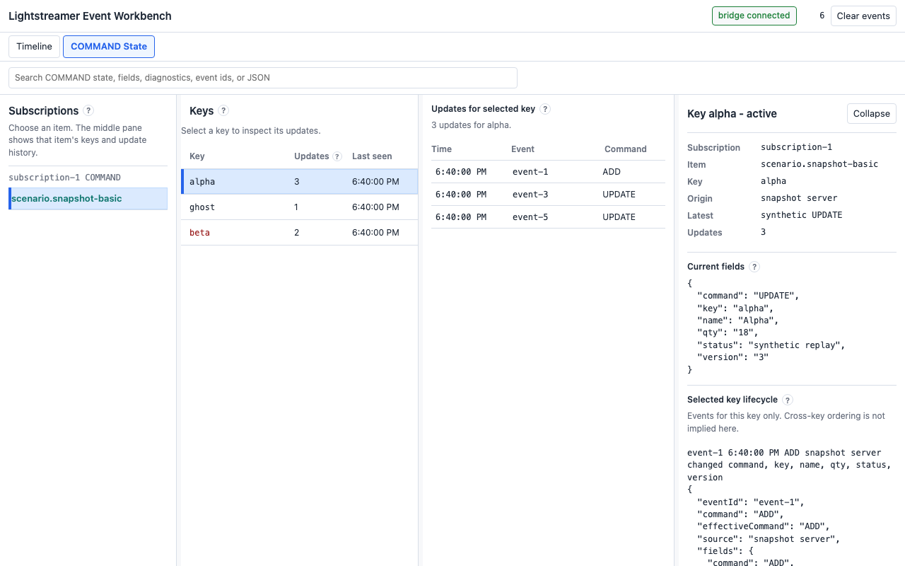

# Lightstreamer Event Workbench

Lightstreamer Event Workbench is a Chrome DevTools extension for debugging web applications that use the official Lightstreamer Web Client. It captures Lightstreamer clients, subscriptions, item updates, snapshots, COMMAND-mode key lifecycles, and synthetic local replays so developers can understand and reproduce streaming behavior without backend access.

This repository is the public homepage and support location for the extension.



## Status

Version `0.1.1` is the current bug-fix package for Chrome Web Store review. The Chrome Web Store install link will be added here after approval. Until then, contributors and reviewers can install the extension from source by loading the built `dist/` directory as an unpacked extension.

The first release focuses on in-memory debugging for the current inspected tab. The UI and internal event envelope may evolve as more Lightstreamer workflows are validated.

## Who This Is For

Use Lightstreamer Event Workbench if you are:

- Debugging a web application that uses the official Lightstreamer Web Client.
- Investigating COMMAND subscriptions, keyed rows, ADD/UPDATE/DELETE behavior, snapshots, or deleted-key lifecycles.
- Reproducing a streaming sequence locally when the backend event order is hard to trigger on demand.
- Comparing captured Lightstreamer primitives without relying on application-specific domain objects.
- QA testing a Lightstreamer integration from inside Chrome DevTools.

This extension is not a generic WebSocket inspector and is not a replacement for a Lightstreamer server, Data Adapter, or backend test harness.

## What It Does

- Adds a `Lightstreamer Event Workbench` panel to Chrome DevTools.
- Instruments the inspected page at `document_start` so official Lightstreamer Web Client constructors and listeners can be observed.
- Captures client, subscription, subscription listener, item update, snapshot, and COMMAND lifecycle events into an in-memory event store.
- Shows a searchable Timeline with normalized event envelopes and raw diagnostic payloads.
- Reconstructs COMMAND state by subscription, item, key, command, snapshot state, provenance, and diagnostics.
- Lets developers clone compatible captured updates, edit fields, and locally reinject synthetic updates through captured listener paths.
- Provides WebSocket/TLCP fallback diagnostics when primary Web Client API instrumentation is unavailable.
- Marks synthetic events clearly so local replay activity is distinguishable from server-originated updates.

## What It Does Not Do

- It does not send captured data to this project, the maintainers, analytics services, or any external backend.
- It does not persist captured events after the current DevTools/tab session in v1.
- It does not inject data into the real Lightstreamer server stream.
- It does not provide app-specific interpretation rules in the core product.
- It does not support arbitrary WebSocket protocols as first-class domain models.

## Installation

### Chrome Web Store

The extension is currently under Chrome Web Store review. After approval, install from the Chrome Web Store link that will be added here.

### From Source

Requirements:

- Node.js compatible with the package lock in this repository.
- npm.
- Chrome or Chromium.

Build and load the extension:

```bash
npm ci
npm run release:package
```

Then:

1. Open `chrome://extensions`.
2. Enable `Developer mode`.
3. Select `Load unpacked`.
4. Choose the generated `dist/` directory from this repository.
5. Open a page that uses the official Lightstreamer Web Client.
6. Open Chrome DevTools and select the `Lightstreamer Event Workbench` panel.

If the target page created Lightstreamer clients before the extension was loaded, refresh the page with DevTools open so instrumentation can attach early.

## Basic Usage

1. Navigate to a page that uses the official Lightstreamer Web Client.
2. Open Chrome DevTools.
3. Select the `Lightstreamer Event Workbench` panel.
4. Refresh the inspected page if capture does not begin.
5. Use `Timeline` to inspect captured event envelopes and raw diagnostics.
6. Use `COMMAND State` to inspect active keys, deleted keys, diagnostics, and selected-key lifecycle.
7. Clone a compatible captured update or create a new COMMAND update draft when you need to test local listener-path reinjection.

Local reinjection is developer controlled and affects the inspected page through captured listener callbacks. It is useful for replaying UI behavior, not for changing backend state.

## Privacy And Safety

Lightstreamer Event Workbench runs locally in the browser extension context. Captured event data is kept in memory for the current tab/session and is not transmitted off-device by the extension.

The extension requests broad page access because it must instrument the inspected page's Lightstreamer Web Client runtime before application code creates clients or subscriptions. Use it only on pages you are authorized to debug, and avoid sharing screenshots or issue logs that contain production secrets, customer data, tokens, or proprietary event payloads.

Synthetic events are marked in the UI and event envelope. v1 local reinjection uses captured listener paths and does not create a real inbound Lightstreamer server event.

## Development

Install dependencies:

```bash
npm ci
```

Run the main checks:

```bash
npm run typecheck
npm test
npm run build
```

Package the extension:

```bash
npm run release:package
```

Run the deterministic Lightstreamer fixture smoke test:

```bash
npm run fixture:test
```

The fixture path uses Docker to run a local Lightstreamer server container and builds the Java test adapter before exercising capture behavior.

## Repository Layout

```text
public/                  Manifest, DevTools entry page, and extension icons
src/injected/            MAIN-world Lightstreamer instrumentation
src/content/             Content-script bridge between page and extension runtime
src/extension/           Background service worker, DevTools page, and panel UI
src/core/                Event envelope, normalization, filtering, COMMAND state, and synthetic drafts
src/bridge/              Message contracts between extension contexts
tests/                   Unit, panel, bridge, instrumentation, and fixture tests
fixtures/lightstreamer/  Local Lightstreamer smoke-test fixture
scripts/                 Build, package, fixture, store listing, and release helpers
store-listing/           Chrome Web Store copy, screenshots, icons, and promo assets
```

The project intentionally models Lightstreamer primitives first: client, session, subscription, mode, item, field, key, command, update, snapshot, and synthetic replay. Keep app-specific concepts out of core modules unless they are added as optional adapters.

## Contributing

Contributions are welcome through GitHub issues and pull requests.

- Read [CONTRIBUTING.md](CONTRIBUTING.md) before opening a pull request.
- Use the issue templates for bug reports, feature requests, and usage questions.
- Search existing issues first so related reports can be grouped.
- Include Chrome version, extension version, Lightstreamer Web Client version when known, repro steps, screenshots, and sanitized event payload examples for bugs.
- Keep PRs focused. A change that touches instrumentation, event normalization, COMMAND state, and UI should explain the cross-context behavior and include tests.

Maintainer release notes and Chrome Web Store publishing details are in [RELEASE.md](RELEASE.md).

## Security Reports

Please do not publish exploit details, sensitive production event payloads, tokens, or customer data in public issues. See [SECURITY.md](SECURITY.md) for the security reporting path and examples of security-sensitive findings.

## External References

- [Lightstreamer Web Client API](https://sdk.lightstreamer.com/ls-web-client/9.0.0/api/index.html)
- [Lightstreamer General Concepts](https://lightstreamer.com/ls-server/latest/docs/General%20Concepts.pdf)
- [Chrome DevTools panel extension API](https://developer.chrome.com/docs/extensions/reference/api/devtools/panels)
- [Chrome content script execution worlds](https://developer.chrome.com/docs/extensions/reference/manifest/content-scripts)

## License

This repository does not currently declare an open-source license. Until a license file is added, source availability on GitHub should not be treated as permission to redistribute or reuse the project outside normal GitHub contribution workflows.
