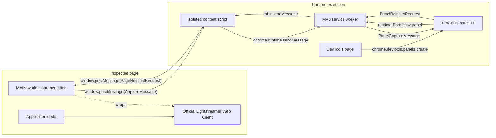
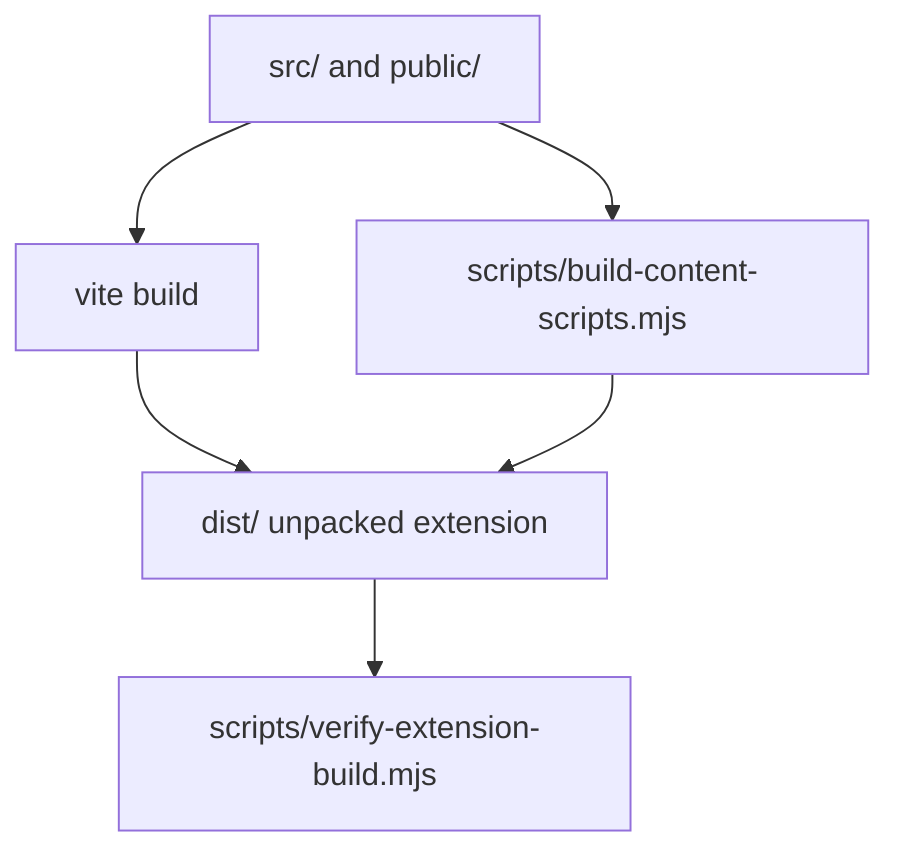
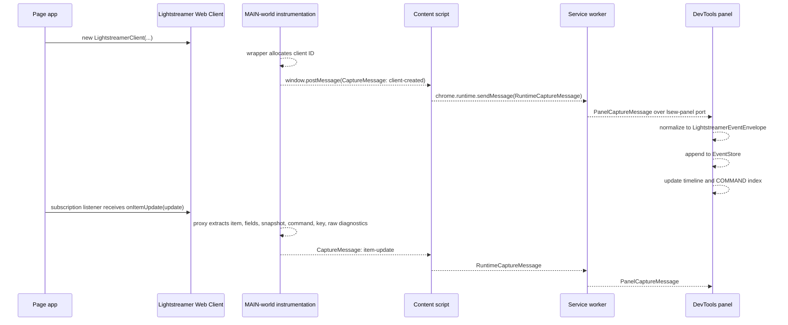
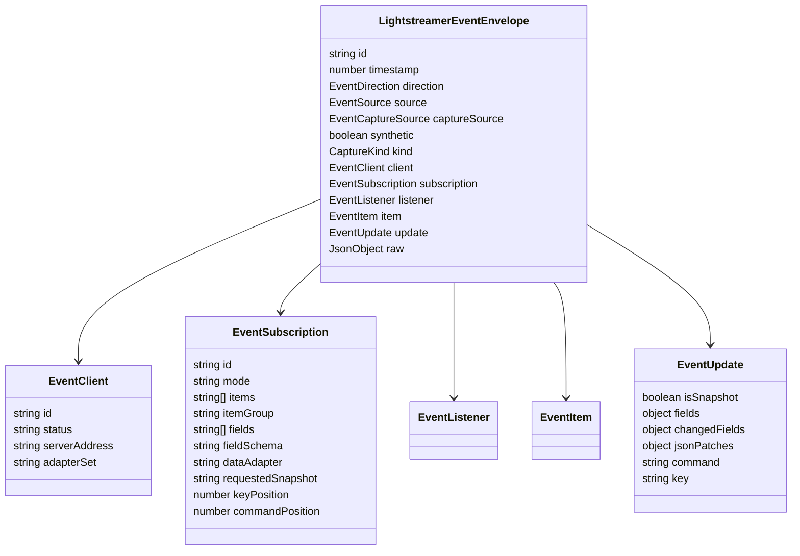
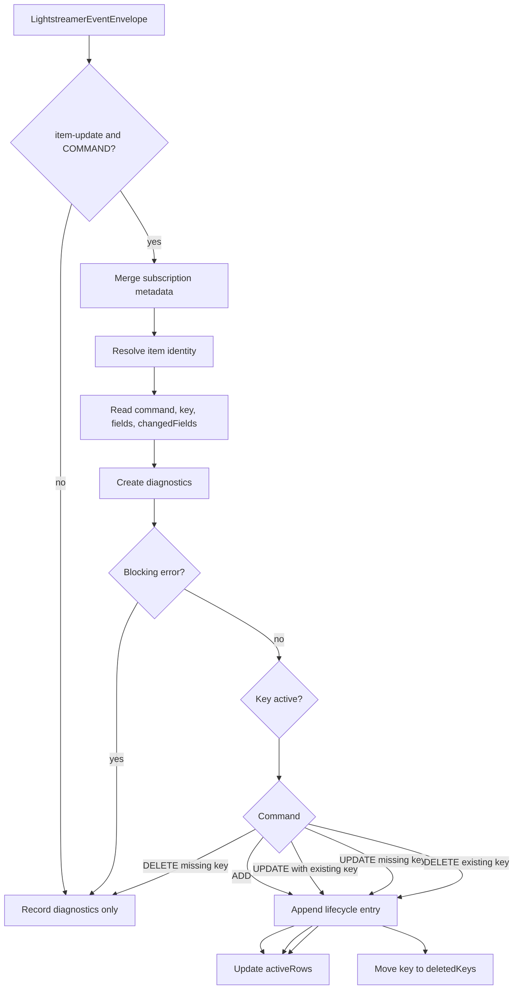
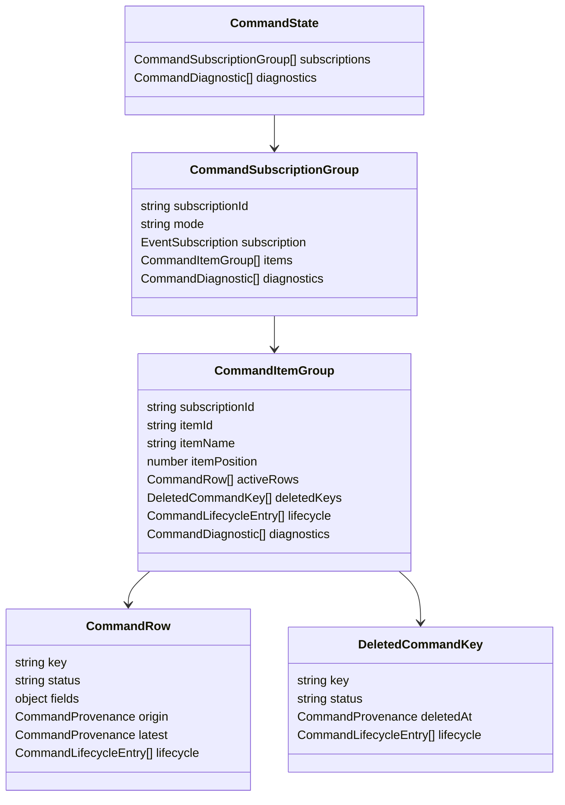
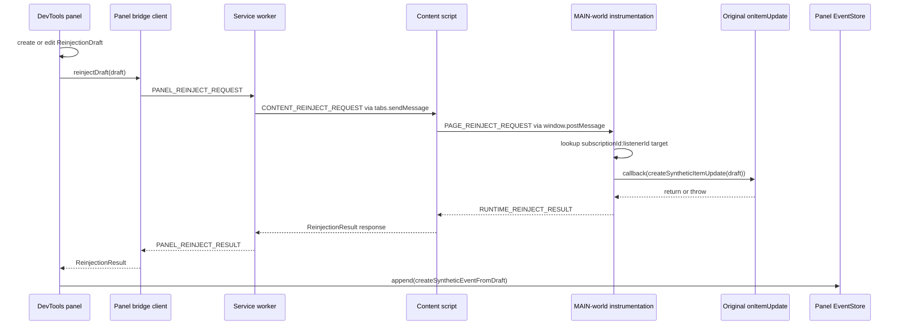

<!-- generated-by: gsd-doc-writer -->
# Architecture

Lightstreamer Event Workbench is a Chrome Manifest V3 DevTools extension that instruments the inspected page, captures Lightstreamer Web Client activity, normalizes it into internal event envelopes, stores it for the current DevTools session, reconstructs COMMAND-mode state, and lets developers locally reinject synthetic updates through captured listener callbacks.

The architecture is event-driven and split across Chrome extension execution contexts. Page-owned code is observed in the page `MAIN` world, capture and reinjection messages cross the isolated content-script boundary, the service worker routes messages by inspected tab, and the DevTools panel owns storage, filtering, UI state, COMMAND reduction, and local synthetic event display.

## Contents

- [System Goals](#system-goals)
- [Runtime Contexts](#runtime-contexts)
- [Repository Layout](#repository-layout)
- [Build Outputs](#build-outputs)
- [Capture Architecture](#capture-architecture)
- [Message Contracts](#message-contracts)
- [Event Model](#event-model)
- [Storage Architecture](#storage-architecture)
- [COMMAND State Architecture](#command-state-architecture)
- [Synthetic Reinjection Architecture](#synthetic-reinjection-architecture)
- [Panel UI Architecture](#panel-ui-architecture)
- [Lightstreamer Fixture](#lightstreamer-fixture)
- [Testing Architecture](#testing-architecture)
- [Extension Points](#extension-points)
- [Operational Notes](#operational-notes)

## System Goals

The project is designed around these concrete implementation goals:

- Capture official Lightstreamer Web Client primitives rather than app-specific business objects.
- Run entirely inside a Chrome DevTools extension for the inspected tab.
- Install instrumentation at `document_start` so clients, subscriptions, and listeners can be wrapped before application code uses them.
- Preserve application behavior while observing constructor calls, lifecycle methods, listener callbacks, and selected wire-level fallback frames.
- Keep capture data local to the browser extension session.
- Support backend-free local reinjection by invoking captured listener callbacks with synthetic `ItemUpdate`-like objects.
- Mark synthetic updates in the normalized event stream and UI.

## Runtime Contexts

The extension runs in four active JavaScript contexts plus optional test fixtures:

| Context | Source | Built Output | Main Responsibility |
| --- | --- | --- | --- |
| Page `MAIN` world instrumentation | `src/injected/lightstreamer-instrumentation.ts` | `dist/injected/lightstreamer-instrumentation.js` | Wrap Lightstreamer constructors, client/subscription methods, subscription listeners, WebSocket fallback, and page-side reinjection handling. |
| Isolated content bridge | `src/content/content-script.ts` | `dist/content/content-script.js` | Forward page `postMessage` capture events to the extension runtime and forward reinjection requests back into the page. |
| Extension service worker | `src/extension/background.ts` | `dist/extension/background.js` | Register DevTools panel ports by tab, route capture messages from content scripts to the right panel, and route reinjection requests from the panel to the inspected tab. |
| DevTools page loader | `src/extension/devtools.ts` | `dist/extension/devtools.js` | Register the `Lightstreamer Event Workbench` DevTools panel. |
| DevTools panel UI | `src/extension/panel/main.ts`, `src/extension/panel/bridge-client.ts`, `src/extension/panel/panel.css`, `src/extension/panel/index.html` | `dist/extension/panel/index.js`, `dist/assets/index.css`, `dist/extension/panel/index.html` | Render timeline and COMMAND views, own event storage, build state indexes, edit drafts, and call the bridge for reinjection. |



## Repository Layout

```text
.
|-- public/
|   |-- manifest.json
|   |-- devtools.html
|   `-- icons/
|-- src/
|   |-- bridge/
|   |-- content/
|   |-- core/
|   |   `-- indexeddb/
|   |-- extension/
|   |   `-- panel/
|   `-- injected/
|-- tests/
|-- fixtures/
|   `-- lightstreamer/
|-- scripts/
|-- docs/
|-- store-listing/
|-- release/
`-- dist/
```

### Source Boundaries

| Directory | Purpose |
| --- | --- |
| `src/bridge/` | Shared message constants, TypeScript contracts, and runtime validators used by all extension contexts. |
| `src/injected/` | Code that must run in the inspected page `MAIN` world so it can patch page-owned Lightstreamer constructors and listener objects. |
| `src/content/` | Isolated content-script bridge between `window.postMessage` in the page and Chrome extension messaging APIs. |
| `src/extension/` | Extension runtime code: MV3 service worker and DevTools panel registration. |
| `src/extension/panel/` | DOM-rendered DevTools panel UI, bridge client, HTML entry, and CSS. |
| `src/core/` | Runtime-independent domain logic: event envelopes, normalization, filtering, storage, COMMAND state reduction, reinjection drafts, synthetic events, and Lightstreamer-like structural types. |
| `src/core/indexeddb/` | IndexedDB schema/open/delete helpers for event storage. |
| `tests/` | Vitest unit and jsdom integration tests for bridge, instrumentation, core reducers, panel UI, CSS, storage, and reinjection. |
| `fixtures/lightstreamer/` | Deterministic Lightstreamer fixture server assets, Java adapters, and browser fixture page. |
| `scripts/` | Build, extension packaging, Chrome Web Store, store asset, and Lightstreamer fixture helper scripts. |
| `public/` | Static extension manifest, DevTools loader HTML, and icons copied into `dist/`. |
| `dist/` | Generated extension output loaded by Chrome as an unpacked extension. |
| `docs/` | GitHub Pages product site assets and project documentation. |
| `store-listing/` | Chrome Web Store listing copy and media assets. |
| `release/` | Packaged release artifacts. |

## Build Outputs

The package is TypeScript ESM with Vite and Vitest configuration in `vite.config.ts`. The build command in `package.json` is:

```bash
npm run build
```

That script expands to:

```bash
vite build && node scripts/build-content-scripts.mjs && node scripts/verify-extension-build.mjs
```

### Build Pipeline



Vite uses `src/` as its root and writes to `dist/`. Its Rollup entry points are:

- `src/extension/background.ts` to `dist/extension/background.js`
- `src/extension/devtools.ts` to `dist/extension/devtools.js`
- `src/extension/panel/index.html` to `dist/extension/panel/index.html` and bundled panel assets

The two content scripts are rebuilt separately by `scripts/build-content-scripts.mjs` with esbuild:

- `src/content/content-script.ts` to `dist/content/content-script.js`
- `src/injected/lightstreamer-instrumentation.ts` to `dist/injected/lightstreamer-instrumentation.js`

Those scripts are bundled as browser IIFEs because Chrome content scripts listed in `manifest.json` must not depend on Vite runtime chunks. `scripts/verify-extension-build.mjs` reads `dist/manifest.json`, opens every manifest-listed content script, and fails the build if a content script still contains top-level ESM import/export syntax or relative chunk references.

`public/manifest.json` declares:

- Manifest V3
- `devtools_page: "devtools.html"`
- background service worker `extension/background.js`
- MAIN-world instrumentation script at `document_start`
- isolated content bridge at `document_start`

## Capture Architecture

Capture starts in the inspected page, where the instrumentation script installs constructor hooks and callback proxies.

### Primary API Instrumentation

`installLightstreamerInstrumentation()` in `src/injected/lightstreamer-instrumentation.ts` creates an `InstrumentationState` with:

- Stable ID allocators for clients, subscriptions, and listeners.
- WeakSets for already-wrapped clients, subscriptions, and client listeners.
- WeakMaps from subscriptions to listener proxies.
- A WeakMap from subscriptions to clients, used to attach client IDs to subscription callback events.
- A map of reinjection listener targets keyed by `subscriptionId:listenerId`.
- A WeakMap of original `onItemUpdate` callbacks used for synthetic local reinjection.
- An `emit()` function that posts validated capture messages to the page.

It hooks all of these Lightstreamer constructor locations:

- `window.LightstreamerClient`
- `window.Subscription`
- `window.Lightstreamer.LightstreamerClient`
- `window.Lightstreamer.Subscription`
- late assignments to `window.Lightstreamer`

Constructor hooks preserve prototype chains by using `Reflect.construct`, copying the original prototype, and setting the wrapper constructor prototype to the original constructor.

Wrapped client methods:

| Method | Captured Effect |
| --- | --- |
| `connect()` | Emits `client-status`. |
| `disconnect()` | Emits `client-status`. |
| `subscribe(subscription)` | Wraps the subscription, records subscription-to-client ownership, emits `subscription-started`. |
| `unsubscribe(subscription)` | Emits `subscription-ended`. |
| `addListener(listener)` | Wraps client listener callbacks and emits `listener-added`. |
| `removeListener(listener)` | Emits `listener-removed`. |

Wrapped subscription behavior:

- `addListener(listener)` replaces the listener with a proxy that captures selected callback invocations.
- `removeListener(listener)` removes the matching proxy and unregisters reinjection target state.
- The original listener object remains the public identity used for stable listener IDs.

Captured subscription callbacks are listed in `CALLBACKS_TO_CAPTURE`:

- `onEndOfSnapshot`
- `onItemLostUpdates`
- `onClearSnapshot`
- `onItemUpdate`
- `onSubscription`
- `onUnsubscription`
- `onSubscriptionError`

Callback names are mapped to capture kinds by `callbackToKind()`. For `onItemUpdate`, `readItemUpdatePayload()` extracts:

- `item.name` from `getItemName()`
- `item.position` from `getItemPos()`
- `update.isSnapshot` from `isSnapshot()`
- full field values from `forEachField()`
- changed field values from `forEachChangedField()`
- JSON patches from `getValueAsJSONPatchIfAvailable(fieldName)`
- COMMAND `command` and `key` from explicit update fields
- raw extraction diagnostics, field counts, callback name, and callback args summary

### WebSocket/TLCP Fallback

The same injected module installs a fallback wrapper around `window.WebSocket` when available. It only performs fallback capture when:

- `host.__LSEW_WS_FALLBACK__` has not already been set.
- the URL contains `/lightstreamer`.
- primary API instrumentation has not marked `host.__LSEW_PRIMARY_ACTIVE__`.

The fallback emits events derived from Lightstreamer TLCP-like text frames:

| Frame or Request | Captured Kind |
| --- | --- |
| WebSocket constructor URL | `client-created` |
| outbound `LS_op=add` | `subscription-created` |
| outbound `LS_op=delete` | `subscription-ended` |
| inbound `CONOK` | `client-status` |
| inbound `SUBOK` or `SUBCMD` | `subscription-started` |
| inbound `UNSUB` | `subscription-ended` |
| inbound `EOS` | `end-of-snapshot` |
| inbound `CS` | `clear-snapshot` |
| inbound `OV` | `lost-updates` |
| inbound `U` | `item-update` |

The fallback maintains per-socket `WireConnectionState`, per-subscription `WireSubscriptionState`, and per-item field snapshots so updates can carry current fields and changed fields. For COMMAND subscriptions, `SUBCMD` supplies key and command field positions; `applyCommandFieldAliases()` renames generated positional fields to `key` and `command` when possible.

Fallback raw diagnostics include `captureSource: "websocket-tlcp"` so normalization marks the event as `captureSource: "wire"`.

### Capture Flow



## Message Contracts

All shared message types and validators live in `src/bridge/messages.ts`. They are intentionally used at every boundary where untrusted runtime data crosses contexts.

### Capture Message

Every capture message has:

| Field | Meaning |
| --- | --- |
| `namespace` | Must be `__LSEW_CAPTURE__`. |
| `version` | Must be `1`. |
| `kind` | One of the known `CAPTURE_KINDS`. |
| `timestamp` | Finite number. |
| `payload` | JSON object, recursively validated as finite JSON data with no cycles. |

Known capture kinds are:

```text
client-created
client-status
subscription-created
subscription-started
subscription-ended
subscription-error
listener-added
listener-removed
item-update
end-of-snapshot
lost-updates
clear-snapshot
```

`createCaptureMessage()` builds capture messages, and `isCaptureMessage()` validates inbound values before forwarding.

### Extension Routing Messages

| Message | Direction | Purpose |
| --- | --- | --- |
| `RUNTIME_CAPTURE_MESSAGE` | content script to service worker | Wrap a page capture message for Chrome runtime messaging. |
| `PANEL_REGISTER_MESSAGE` | panel to service worker | Register the panel port for `chrome.devtools.inspectedWindow.tabId`. |
| `PANEL_STATUS_MESSAGE` | service worker to panel | Report bridge lifecycle status. |
| `PANEL_CAPTURE_MESSAGE` | service worker to panel | Deliver a capture message to the matching inspected tab panel. |
| `PANEL_REINJECT_REQUEST` | panel to service worker | Ask to reinject a serialized draft. |
| `CONTENT_REINJECT_REQUEST` | service worker to content script | Forward panel reinjection request to the inspected tab. |
| `PAGE_REINJECT_REQUEST` | content script to page | Ask MAIN-world instrumentation to call the captured listener. |
| `RUNTIME_REINJECT_RESULT` | page to content script | Return page-side reinjection result. |
| `PANEL_REINJECT_RESULT` | service worker to panel | Return reinjection result to the panel. |

### Reinjection Draft Payload

`isReinjectionDraftPayload()` requires:

- non-empty `sourceEventId`
- non-empty `target.subscriptionId`
- non-empty `target.listenerId`
- an item name or an integer item position
- non-empty `command`
- non-empty `key`
- at least one field in `fields`
- JSON-compatible `provenance`
- finite string, number, boolean, or null field values

Reinjection results use one of these statuses:

- `success`
- `stale-target`
- `listener-error`
- `bridge-error`

## Event Model

The normalized event shape is defined by `LightstreamerEventEnvelope` in `src/core/event-envelope.ts`.



`src/core/event-normalizer.ts` converts raw capture messages into this envelope:

- IDs are assigned as `event-1`, `event-2`, and so on by `createEventNormalizer()`.
- Direction is currently normalized to `inbound`.
- Source is normalized to `server` for captured runtime messages.
- `synthetic` is `false` for captured runtime messages.
- `captureSource` is `wire` when raw diagnostics include `captureSource: "websocket-tlcp"`, otherwise `listener`.
- Client, subscription, listener, item, update, and raw data are copied only when they match expected JSON shapes.
- `update.command` and `update.key` can come from explicit update values or from normalized field records.

Synthetic events are created separately by `createSyntheticEventFromDraft()` in `src/core/synthetic-event.ts` and are marked with:

- `id: synthetic-{requestId}`
- `source: "synthetic"`
- `synthetic: true`
- `kind: "item-update"`
- `subscription.mode: "COMMAND"`
- raw provenance including source event ID, target subscription/listener IDs, request ID, result status, edited fields, and draft provenance

## Storage Architecture

The panel depends on the `EventStore` interface from `src/core/event-store.ts`:

```text
append(event)
queryEvents(query)
getEventById(id)
list(filters)
count()
stats()
clear()
subscribe(listener)
close?()
```

There are two concrete storage paths:

| Store | Factory | Backing Storage | Notes |
| --- | --- | --- | --- |
| In-memory store | `createEventStore()` | Array in panel runtime memory | Synchronous, test-friendly, returns immutable list snapshots. |
| IndexedDB store | `createIndexedDbEventStore()` | IndexedDB via `EventRepository` | Async, stores event envelopes plus derived metadata and search tokens. |

`bootPanel()` calls `createPanelEventStore()`, which attempts:

```ts
createIndexedDbEventStore({
  sessionId: chrome.devtools?.inspectedWindow?.tabId ?? Date.now(),
  reset: true
})
```

If IndexedDB open/reset fails, the panel logs the error and falls back to `createEventStore()`.

### IndexedDB Schema

`src/core/indexeddb/event-db.ts` uses schema version `1` and default database name `lsew-events-session`. Session-scoped names are generated as `lsew-events-{sanitizedSessionId}`.

Object stores:

| Store | Key | Purpose |
| --- | --- | --- |
| `events` | auto-increment `seq` | Stores `{ id, envelope }`; has unique `id` index. |
| `eventMeta` | `seq` | Stores denormalized filter fields such as kind, subscription ID, mode, item, command key, command value, snapshot, and synthetic marker. |
| `eventSearchTokens` | `[token, seq]` | Stores tokenized text search index; has `token` and `seq` indexes. |

`src/core/event-repository.ts` handles IndexedDB queries by:

1. Tokenizing query text from `createEventSearchText()`.
2. Selecting one indexed structured filter when possible.
3. Intersecting text token matches when a search query is present.
4. Applying residual filters through `matchesEventFilters()`.
5. Sorting by sequence and paging.
6. Loading full envelopes from the `events` store.

### Event Store Stats

Both store implementations track:

- retained event count
- total appended event count
- warning threshold
- warning active flag

`DEFAULT_EVENT_WARNING_THRESHOLD` is `10_000`. The panel does not prune retained events when the warning is active. It shows a high-volume notice with `Keep events` and `Clear events` actions.

## COMMAND State Architecture

COMMAND state logic lives in `src/core/command-state.ts`. It is independent of the DOM and can run as a full reducer or incremental index:

- `reduceCommandState(events)` folds an array into a `CommandState`.
- `createCommandStateIndex()` exposes `apply(event)`, `clear()`, and `snapshot()`.

The panel uses the incremental index. On store initialization it replays all existing events into the index. On append it applies the new event.

### COMMAND Reduction Rules

Only events with `kind: "item-update"` and a resolved subscription mode of `COMMAND` affect COMMAND state.

Subscription metadata is carried forward by `knownSubscriptions`. This lets later item-update events with id-only subscription payloads reuse previously captured mode, items, fields, item group, key position, command position, and adapter metadata.

Item identity is resolved by `resolveCommandItemIdentity()`:

| Available Data | Item ID Strategy |
| --- | --- |
| Explicit item name | `name:{itemName}` |
| Subscription `items[]` plus item position | `name:{items[position - 1]}` |
| Item group plus item position | `group:{itemGroup}:position:{position}` |
| Position only | `position:{position}` |
| Nothing usable | `unknown-item` |

COMMAND lifecycle commands are normalized to uppercase and only `ADD`, `UPDATE`, and `DELETE` are supported.



### Diagnostics

Diagnostics have severity `error` or `warning`, a code, optional server-like message, explanation, and suggestion.

| Code | Severity | Meaning |
| --- | --- | --- |
| `missing-command` | error | COMMAND event has no command value. |
| `missing-key` | error | COMMAND event has no key value. |
| `unsupported-command` | error | Command is not `ADD`, `UPDATE`, or `DELETE`. |
| `unknown-key-delete` | warning | DELETE references a key that is not active, so no row is removed. |
| `unknown-key-update` | warning | UPDATE references a missing key and is treated as effective ADD. |
| `snapshot-update` | warning | Snapshot event used UPDATE. |
| `snapshot-delete` | warning | Snapshot event used DELETE. |

### State Shape



Provenance labels are:

- `snapshot`
- `live`
- `synthetic-live`
- `synthetic-snapshot`

Each active row keeps origin provenance and latest provenance separately. Deleted keys keep a tombstone with delete provenance and lifecycle history.

## Synthetic Reinjection Architecture

The project does not inject data into a real Lightstreamer server stream. Reinjection is local and listener-path based:

1. The injected script captures the original listener's `onItemUpdate` callback when a subscription listener is added.
2. The panel creates a `ReinjectionDraft`.
3. The panel bridge serializes and validates the draft.
4. The service worker routes the request to the inspected tab.
5. The content script posts a page message.
6. The injected script finds the original listener target and calls it with a synthetic `ItemUpdate`-like object.
7. The injected script returns a `ReinjectionResult`.
8. On success, the panel appends a local synthetic event envelope to its store.



### Synthetic ItemUpdate Shape

The page-side synthetic update implements:

- `forEachField(iterator)`
- `forEachChangedField(iterator)`
- `getItemName()`
- `getItemPos()`
- `getValue(fieldName)`
- `getValueAsJSONPatchIfAvailable(fieldName)`, currently returns `null`
- `isSnapshot()`
- `isValueChanged(fieldName)`

`createSyntheticItemUpdate()` copies draft fields and ensures `command` and `key` are present in the synthetic field set.

### Draft Workflows

`src/core/reinjection-draft.ts` supports two draft sources:

| Workflow | Function | UI Location | Notes |
| --- | --- | --- | --- |
| Clone captured event | `createDraftFromEvent(event)` | Timeline event detail | Requires a captured `item-update`, copies fields, changed fields, item, target subscription, and listener. |
| New COMMAND update | `createNewCommandDraftFromContext(context)` | COMMAND detail pane | Requires captured COMMAND subscription, item, listener target, and field schema including `command` and `key`. |

Draft mutation helpers:

- `updateDraftField()`
- `updateDraftCommand()`
- `updateDraftKey()`
- `updateDraftSnapshot()`
- `setManualChangedFieldsOverride()`
- `deriveChangedFields()`

Draft validation:

- `validateEditableDraft()` checks source, subscription target, item context, fields, and field names.
- `validateReinjectionDraft()` additionally requires listener target, command, and key.
- `validateNewCommandDraft()` checks captured COMMAND context, schema membership, listener target, and semantic COMMAND validity against current state.

## Panel UI Architecture

The panel is written as direct DOM construction in `src/extension/panel/main.ts`, with CSS in `src/extension/panel/panel.css`. It does not use React, Vue, or another UI component framework.

`renderPanel(root, state, options)` creates and returns a `PanelController`:

```text
setStatus(status)
appendCaptureMessage(message)
clearEvents()
setBridge(bridge)
dispose()
```

### Panel State Ownership

The panel owns these major state categories:

- bridge status badge
- selected timeline event and pin state
- current timeline query version and render limit
- event store stats and high-volume notice state
- active reinjection draft and reinjection status message
- active view: `timeline` or `command`
- timeline detail pane open/width state
- COMMAND detail pane open state
- COMMAND context events and incremental COMMAND index
- selected COMMAND subscription item, key, and update event
- resizable COMMAND pane widths
- timeline filters and COMMAND filters
- render scheduling/defer state during pointer and keyboard interactions

### Timeline View

The Timeline view renders:

- toolbar with product label, status, event count, filtered count, retention notice, and clear button
- search input backed by `EventFilterState.query`
- event rows with time, kind, client, subscription, mode, item, command/key, and source marker
- collapsible detail pane with envelope, subscription, listener, item, raw diagnostics, update, synthetic provenance, and reinjection draft sections

`renderFeed()` queries the store with:

```ts
store.queryEvents({
  filters: filterState,
  order: "asc",
  limit: timelineRenderLimit
})
```

The first render limit is `500`. Scrolling near the top or bottom increases the limit by another `500` until all matching retained events are shown.

### COMMAND State View

The COMMAND view renders four panes:

1. Subscriptions and items.
2. Keys for the selected item, including active and deleted keys.
3. Updates for the selected key.
4. Detail pane for selected key, selected update, diagnostics, and new COMMAND update editor.

Pane widths are stored in CSS custom properties:

- `--command-subscriptions-width`
- `--command-keys-width`
- `--command-updates-width`

Resize handles are accessible separators with keyboard support for left/right arrow adjustments.

### Render Scheduling

The panel avoids rerendering aggressively during high-volume append bursts:

- The first `IMMEDIATE_APPEND_RENDER_BUDGET` appends render immediately.
- Later appends are scheduled with `requestAnimationFrame` when available, or a 16 ms timeout fallback.
- Pointer and keyboard activation defer store-triggered renders until the interaction completes.
- Detail panes can preserve scroll position, focus selector, text selection, and open/closed `details` section state across rerenders.

## Lightstreamer Fixture

The fixture under `fixtures/lightstreamer/` provides deterministic scenarios for local and CI-style verification.

| File | Purpose |
| --- | --- |
| `fixtures/lightstreamer/pages/index.html` | Browser fixture page served by the Lightstreamer fixture scripts. |
| `fixtures/lightstreamer/pages/fixture-client.js` | Creates Lightstreamer COMMAND subscriptions and exposes expected deterministic event counts. |
| `fixtures/lightstreamer/adapter/src/main/java/dev/lightstreamer/workbench/FixtureDataAdapter.java` | Emits deterministic snapshot/live COMMAND rows through a Lightstreamer `SmartDataProvider`. |
| `fixtures/lightstreamer/adapter/src/main/java/dev/lightstreamer/workbench/FixtureMetadataAdapter.java` | Expands the `salesActivity.STORE_NYC_001` item group into invoice and expense items. |
| `fixtures/lightstreamer/adapters/LSEW_FIXTURE/adapters.xml` | Registers fixture data and metadata adapter classes under adapter set `LSEW_FIXTURE`. |
| `scripts/lightstreamer/*` | Helper scripts for building, starting, waiting on, stopping, and testing the fixture. |

Fixture scenarios include:

- `scenario.snapshot-basic`
- `scenario.add-update-delete`
- high-volume issue-style subscriptions totaling 1,692 expected events across 17 item groups in `fixture-client.js`

The fixture page creates a `LightstreamerClient` for `http://localhost:8080` with adapter set `LSEW_FIXTURE`, adds subscription listeners, connects, and subscribes.

## Testing Architecture

Tests run with:

```bash
npm test
```

Vitest is configured in `vite.config.ts` with:

- environment: `jsdom`
- globals enabled
- include pattern: `tests/**/*.test.ts`

The default `npm test` command runs the Vitest files ending in `.test.ts`. The Lightstreamer fixture smoke check is separate and runs through:

```bash
npm run fixture:test
```

Coverage is organized by architectural boundary:

| Test File | Boundary Covered |
| --- | --- |
| `tests/bridge-message-validation.test.ts` | Capture and reinjection message validators plus stable ID allocation. |
| `tests/instrumentation-lifecycle.test.ts` | Constructor hooks, namespace hooks, lifecycle wrappers, stable IDs, listener proxies, WebSocket fallback, and page-side reinjection result behavior. |
| `tests/event-normalizer.test.ts` | Capture-to-envelope normalization, COMMAND key/command preservation, current vs changed fields, snapshot status, and wire source mapping. |
| `tests/event-filter.test.ts` | Event search text and structured filters. |
| `tests/event-store.test.ts` | In-memory store behavior, high-volume stats, IndexedDB-backed queries, token search, reset, and open-connection reset behavior. |
| `tests/command-state.test.ts` | Full and incremental COMMAND reduction, grouping, metadata carry-forward, item identity, lifecycle, provenance, diagnostics, and draft validation against state. |
| `tests/reinjection-draft.test.ts` | Draft cloning, editing, changed-field derivation, validation, and JSON compatibility. |
| `tests/command-draft.test.ts` | Context-bound new COMMAND drafts, schema validation, and synthetic event conversion. |
| `tests/synthetic-event.test.ts` | Synthetic envelope creation from successful reinjection results. |
| `tests/panel-bridge-client.test.ts` | Panel port registration, reconnect, reinjection request routing, timeout/error behavior. |
| `tests/panel-shell.test.ts` | Timeline shell rendering, event detail, filtering, high-volume notices, lazy row rendering, clone/reinject UI. |
| `tests/panel-command-state.test.ts` | COMMAND State workbench rendering, selection, filtering, panes, draft editor, and synthetic append behavior. |
| `tests/panel-css.test.ts` | CSS constraints for the panel. |
| `tests/lightstreamer-fixture-capture.spec.ts` | Fixture smoke assertions against served fixture page and Java adapter source; run by `npm run fixture:test`. |

Other quality commands:

```bash
npm run typecheck
npm run build
```

Release packaging uses `scripts/package-extension.mjs`, which by default runs typecheck, tests, build verification, extension build validation, and deterministic ZIP creation.

## Extension Points

### Adding a Capture Kind

1. Add the kind to `CAPTURE_KINDS` in `src/bridge/messages.ts`.
2. Emit it from instrumentation or fallback code.
3. Update `LightstreamerEventEnvelope` only if the normalized model needs new top-level fields.
4. Update `event-normalizer.ts` conversion logic.
5. Update `event-filter.ts` or IndexedDB metadata if the kind needs search/filter support.
6. Add tests for validator acceptance, normalization, storage/filtering, and panel rendering.

### Adding Normalized Event Fields

1. Extend the relevant type in `src/core/event-envelope.ts`.
2. Convert only validated JSON data in `src/core/event-normalizer.ts`.
3. Include search text in `createEventSearchText()` if users should find it.
4. Add IndexedDB metadata/index support only when the field needs efficient structured filtering.
5. Render it in panel detail or tables where useful.

### Changing COMMAND Semantics

1. Update `src/core/command-state.ts`.
2. Add or adjust diagnostics with server-like messages, explanations, and suggestions.
3. Update `validateCommandDraftAgainstState()` and `validateNewCommandDraft()` when drafts should follow the same semantic rules.
4. Add tests in `tests/command-state.test.ts` and, if UI behavior changes, `tests/panel-command-state.test.ts`.

### Adding UI Features

The panel is DOM-first. Follow the existing pattern:

1. Add state in the `renderPanel()` closure.
2. Build controls with helper functions such as `createTextElement()` and `createFilterInput()`.
3. Preserve detail pane state when rerendering around user input.
4. Use `resolveMaybe()` when code must work with both sync in-memory stores and async IndexedDB stores.
5. Add jsdom tests in `tests/panel-shell.test.ts` or `tests/panel-command-state.test.ts`.

## Operational Notes

- The source of truth for shared cross-context payloads is `src/bridge/messages.ts`; do not bypass these validators at runtime boundaries.
- The injected script must remain self-contained after esbuild bundling because it runs as a manifest content script in the page `MAIN` world.
- The content bridge validates both capture messages and reinjection result messages before forwarding.
- The service worker routes panel ports by inspected tab ID; capture messages without a sender tab ID are ignored.
- The panel may use IndexedDB, but it resets the inspected-tab session on startup and still has a memory fallback.
- Wire fallback events can be inspected and searched, but cloned wire events without an original listener target cannot be reinjected through listener-path replay.
- Synthetic events are local panel events. They are appended only after page-side listener reinjection reports success.
- `dist/` is generated output. Architecture changes should be made in `src/`, `public/`, or `scripts/`, then rebuilt.
