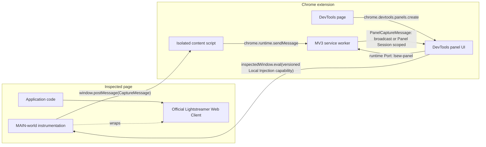
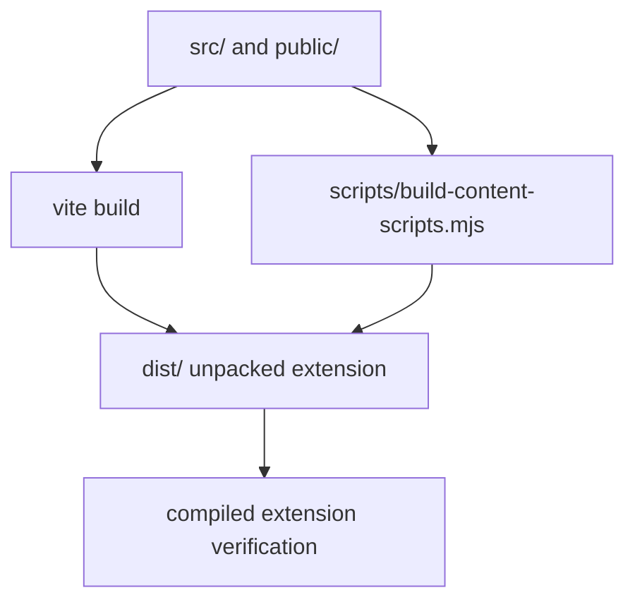
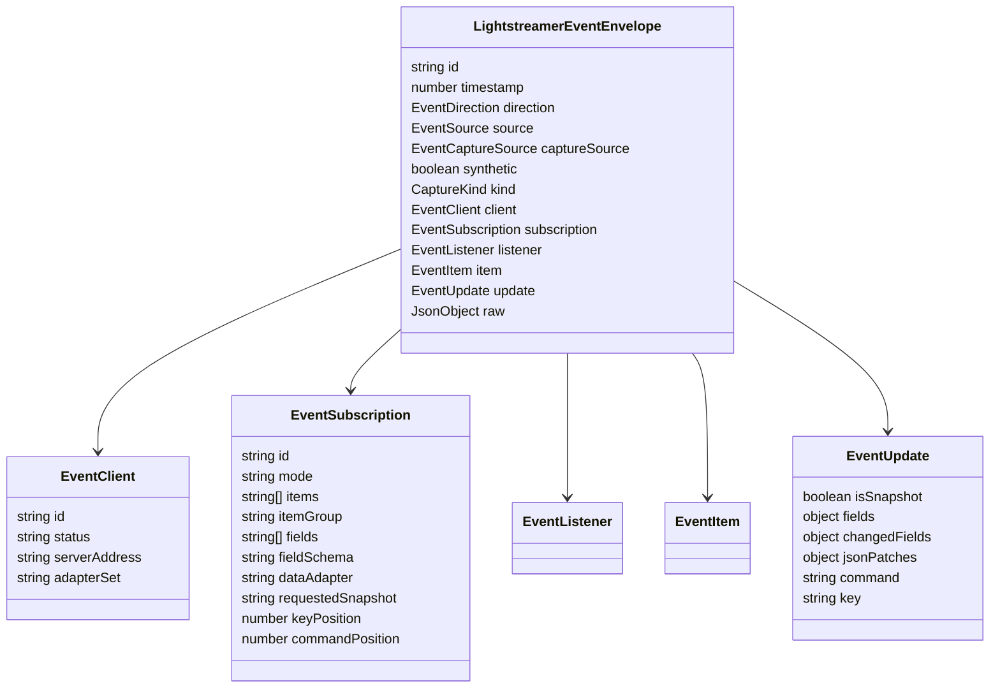
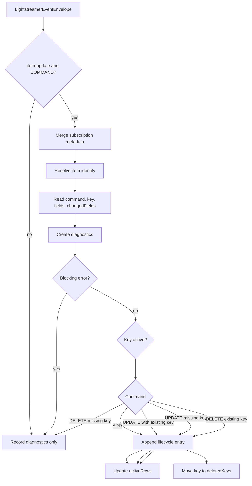
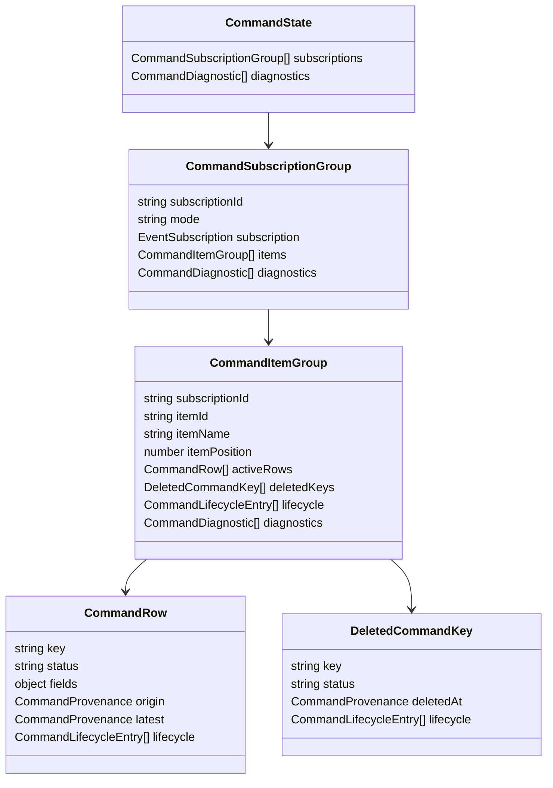
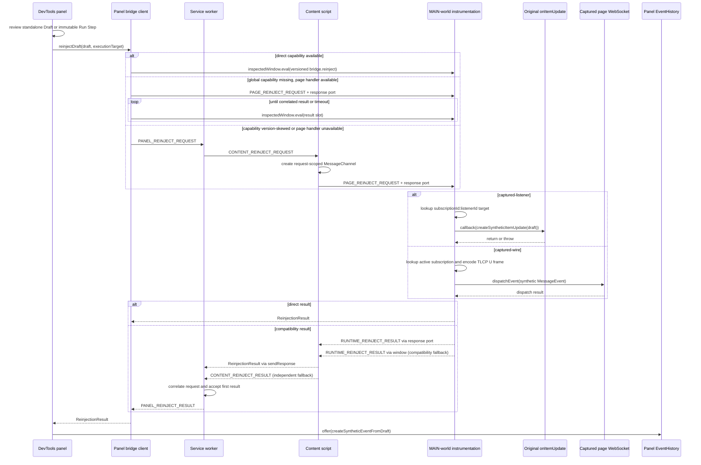

# Architecture

Lightstreamer Workbench is a Chrome Manifest V3 DevTools extension that instruments the inspected page, captures Lightstreamer Web Client activity, normalizes it into internal event envelopes, stores it for the current Panel Session, reconstructs client/session/subscription topology and COMMAND-mode state, and lets developers perform deliberate Local Injections through captured listener callbacks or captured Lightstreamer WebSocket paths.

The architecture is event-driven and split across Chrome extension execution contexts. Page-owned code is observed in the page `MAIN` world, Capture messages cross the isolated content-script boundary, the service worker routes them by inspected tab and Panel Session identity, and a framework-independent `WorkbenchRuntime` owns panel investigation state. React renders the Scoped Evidence Workspace from immutable runtime snapshots. Local Injection prefers a versioned MAIN-world capability invoked directly with `chrome.devtools.inspectedWindow.eval`. If that global capability is absent after an extension refresh, the panel reuses the page's request-scoped message handler directly; version-skewed or otherwise unavailable page contexts retain the compatibility runtime relay.

## Contents

- [System Goals](#system-goals)
- [Runtime Contexts](#runtime-contexts)
- [Repository Layout](#repository-layout)
- [Build Outputs](#build-outputs)
- [Capture Architecture](#capture-architecture)
- [Message Contracts](#message-contracts)
- [Event Model](#event-model)
- [Storage Architecture](#storage-architecture)
- [Diagnostic Observation Architecture](#diagnostic-observation-architecture)
- [Topology State Architecture](#topology-state-architecture)
- [COMMAND State Architecture](#command-state-architecture)
- [Local Injection Delivery Architecture](#local-injection-delivery-architecture)
- [Panel UI Architecture](#panel-ui-architecture)
- [Panel Presentation Seams](#panel-presentation-seams)
- [Remote Data Boundary](#remote-data-boundary)
- [Lightstreamer Fixture](#lightstreamer-fixture)
- [Testing Architecture](#testing-architecture)
- [Extension Points](#extension-points)
- [Operational Notes](#operational-notes)

## System Goals

The project is designed around these concrete implementation goals:

- Capture official Lightstreamer Web Client primitives rather than app-specific business objects.
- Run entirely inside a Chrome DevTools extension for the inspected tab.
- Install instrumentation at `document_start` so clients, subscriptions, and listeners can be wrapped before application code uses them.
- Preserve application behavior while observing constructor calls, lifecycle methods, listener callbacks, and selected wire-level fallback frames.
- Keep Capture and product-usage data local to the browser extension session; version 2 has no analytics, tracking, or remote error transport.
- Support backend-free Local Injection through captured listener callbacks and local TLCP delivery on captured page WebSockets.
- Mark successful Local Injected Updates in the normalized event stream and UI.

## Runtime Contexts

The extension runs in four active JavaScript contexts plus optional test fixtures:

| Context | Source | Built Output | Main Responsibility |
| --- | --- | --- | --- |
| Page `MAIN` world instrumentation | `src/injected/lightstreamer-instrumentation.ts` | `dist/injected/lightstreamer-instrumentation.js` | Wrap Lightstreamer constructors, client/subscription methods, subscription listeners, WebSocket fallback, and the internally named page-side reinjection capability used for Local Injection. |
| Isolated content bridge | `src/content/content-script.ts` | `dist/content/content-script.js` | Forward page `postMessage` Capture events to the extension runtime and retain the internal compatibility relay for Local Injection delivery. |
| Extension service worker | `src/extension/background.ts` | `dist/extension/background.js` | Register DevTools panel ports by `(tabId, PanelSessionId)` and broadcast unscoped live Capture to every panel for the tab while targeting sync and Injection results to one Panel Session; retain compatibility routing for Local Injection when direct inspected-page evaluation is unavailable. |
| DevTools page loader | `src/extension/devtools.ts` | `dist/extension/devtools.js` | Register the `Lightstreamer Workbench` DevTools panel. |
| DevTools panel UI | `src/extension/panel/panel.tsx`, `src/extension/panel/workbench-runtime.ts`, `src/extension/panel/react/`, `src/extension/panel/bridge-client.ts`, `src/extension/panel/index.html` | `dist/extension/panel/index.js`, `dist/assets/index.css`, `dist/extension/panel/index.html` | Mount the React Scoped Evidence Workspace, own session history and investigation state, expose one protected standalone Local Injection Draft or one mutually protected temporary Scenario, call the shared local-delivery coordinator, clear retired 0.1.x telemetry state, and expose first-party Help links. |


```mermaid
flowchart LR
  subgraph Page["Inspected page"]
    App["Application code"]
    LS["Official Lightstreamer Web Client"]
    Injected["MAIN-world instrumentation"]
  end

  subgraph Extension["Chrome extension"]
    Content["Isolated content script"]
    Background["MV3 service worker"]
    Devtools["DevTools page"]
    Panel["DevTools panel UI"]
  end

  App --> LS
  Injected -. wraps .-> LS
  Injected -- "window.postMessage(CaptureMessage)" --> Content
  Content -- "chrome.runtime.sendMessage" --> Background
  Devtools -- "chrome.devtools.panels.create" --> Panel
  Panel -- "runtime Port: lsew-panel" --> Background
  Background -- "PanelCaptureMessage: broadcast or Panel Session scoped" --> Panel
  Panel -- "inspectedWindow.eval(versioned Local Injection capability)" --> Injected
```

## Repository Layout

```text
.
|-- public/
|   |-- manifest.json
|   |-- devtools.html
|   `-- icons/
|-- src/
|   |-- bridge/
|   |-- content/
|   |-- core/
|   |   `-- indexeddb/
|   |-- extension/
|   |   `-- panel/
|   `-- injected/
|-- tests/
|-- fixtures/
|   `-- lightstreamer/
|-- scripts/
|-- site/
|-- docs/
|-- store-listing/
|-- release/
`-- dist/
```

### Source Boundaries

| Directory | Purpose |
| --- | --- |
| `src/bridge/` | Shared message constants, TypeScript contracts, and runtime validators used by all extension contexts. |
| `src/injected/` | Code that must run in the inspected page `MAIN` world so it can patch page-owned Lightstreamer constructors and listener objects. |
| `src/content/` | Isolated content-script bridge between `window.postMessage` in the page and Chrome extension messaging APIs. |
| `src/extension/` | Extension runtime code: MV3 service worker and DevTools panel registration. |
| `src/extension/panel/` | React panel mount, framework-independent `WorkbenchRuntime`, Scoped Evidence Workspace presentation, bridge client, HTML entry, theme, legacy-storage cleanup, first-party resources, and export presentation. |
| `src/core/` | Runtime-independent domain logic: event envelopes, normalization, filtering, storage, COMMAND state reduction, Injection Drafts, synthetic events, and Lightstreamer-like structural types. |
| `src/core/indexeddb/` | IndexedDB schema/open/delete helpers for event storage. |
| `tests/` | Vitest unit and jsdom integration tests for bridge, instrumentation, core reducers, `WorkbenchRuntime`, React presentation, storage, and Local Injection, plus browser and official-client proofs. |
| `fixtures/lightstreamer/` | Deterministic Lightstreamer fixture server assets, Java adapters, and browser fixture page. |
| `scripts/` | Build, extension packaging, Chrome Web Store, store asset, and Lightstreamer fixture helper scripts. |
| `public/` | Static extension manifest, DevTools loader HTML, and icons copied into `dist/`. |
| `dist/` | Generated extension output loaded by Chrome as an unpacked extension. |
| `site/` | Source content, styles, and route configuration for the isolated static GitHub Pages artifact. |
| `docs/` | Project architecture, product contracts, agent instructions, research, and shared generated image assets. It is not deployed as the site root. |
| `store-listing/` | Chrome Web Store listing copy and media assets. |
| `release/` | Packaged release artifacts. |

## Build Outputs

The package is TypeScript ESM with Vite and Vitest configuration in `vite.config.ts`. The build command in `package.json` is:

```bash
npm run build
```

`scripts/build-extension.mjs` orchestrates the Vite extension-page build, the separately bundled content scripts, and compiled-output verification. There is one production renderer and one output directory; no renderer flag, alias, or parallel output artifact exists.

### Build Pipeline


```mermaid
flowchart TD
  Source["src/ and public/"]
  Vite["vite build"]
  Esbuild["scripts/build-content-scripts.mjs"]
  Verify["compiled extension verification"]
  Dist["dist/ unpacked extension"]

  Source --> Vite
  Vite --> Dist
  Source --> Esbuild
  Esbuild --> Dist
  Dist --> Verify
```

Vite uses `src/` as its root and writes to `dist/`. Its Rollup entry points are:

- `src/extension/background.ts` to `dist/extension/background.js`
- `src/extension/devtools.ts` to `dist/extension/devtools.js`
- `src/extension/panel/index.html` to `dist/extension/panel/index.html` and bundled panel assets

The two content scripts are rebuilt separately by `scripts/build-content-scripts.mjs` with esbuild:

- `src/content/content-script.ts` to `dist/content/content-script.js`
- `src/injected/lightstreamer-instrumentation.ts` to `dist/injected/lightstreamer-instrumentation.js`

Those scripts are bundled as browser IIFEs because Chrome content scripts listed in `manifest.json` must not depend on Vite runtime chunks. `scripts/verify-extension-build.mjs` reads `dist/manifest.json`, opens every manifest-listed content script, and fails the build if a content script still contains top-level ESM import/export syntax or relative chunk references.

`public/manifest.json` declares:

- Manifest V3
- `devtools_page: "devtools.html"`
- background service worker `extension/background.js`
- MAIN-world instrumentation script at `document_start`
- isolated content bridge at `document_start`

## Capture Architecture

Capture starts in the inspected page, where the instrumentation script installs constructor hooks and callback proxies.

### Primary API Instrumentation

`installLightstreamerInstrumentation()` in `src/injected/lightstreamer-instrumentation.ts` creates an `InstrumentationState` with:

- Stable ID allocators for clients, subscriptions, and listeners.
- WeakSets for already-wrapped clients, subscriptions, and client listeners.
- WeakMaps from subscriptions to listener proxies.
- A WeakMap from subscriptions to clients, used to attach client IDs to subscription callback events.
- A map of internally named reinjection listener targets keyed by `subscriptionId:listenerId`.
- A map of internally named active wire reinjection targets keyed by normalized Subscription ID, retaining the captured socket and TLCP Subscription schema.
- A WeakSet of synthetic WebSocket `MessageEvent` objects, used to prevent Local Injection delivery from being recaptured as Server traffic.
- A WeakMap of original `onItemUpdate` callbacks available as Local Injection targets.
- An `emit()` function that posts validated capture messages to the page.

It hooks all of these Lightstreamer constructor locations:

- `window.LightstreamerClient`
- `window.Subscription`
- `window.Lightstreamer.LightstreamerClient`
- `window.Lightstreamer.Subscription`
- late assignments to `window.Lightstreamer`

Constructor hooks preserve prototype chains by using `Reflect.construct`, copying the original prototype, and setting the wrapper constructor prototype to the original constructor.

Wrapped client methods:

| Method | Captured Effect |
| --- | --- |
| `connect()` | Emits `client-status`. |
| `disconnect()` | Emits `client-status`. |
| `subscribe(subscription)` | Wraps the subscription, records subscription-to-client ownership, emits `subscription-started`. |
| `unsubscribe(subscription)` | Emits `subscription-ended`. |
| `addListener(listener)` | Wraps client listener callbacks and emits `listener-added`. |
| `removeListener(listener)` | Emits `listener-removed`. |

Wrapped subscription behavior:

- `addListener(listener)` replaces the listener with a proxy that captures selected callback invocations.
- `removeListener(listener)` removes the matching proxy and unregisters the corresponding Local Injection target state.
- The original listener object remains the public identity used for stable listener IDs.

Captured subscription callbacks are listed in `CALLBACKS_TO_CAPTURE`:

- `onEndOfSnapshot`
- `onItemLostUpdates`
- `onClearSnapshot`
- `onItemUpdate`
- `onRealMaxFrequency`
- `onSubscription`
- `onUnsubscription`
- `onSubscriptionError`

Callback names are mapped to capture kinds by `callbackToKind()`. For `onItemUpdate`, `readItemUpdatePayload()` extracts:

- `item.name` from `getItemName()`
- `item.position` from `getItemPos()`
- `update.isSnapshot` from `isSnapshot()`
- full field values from `forEachField()`
- changed field values from `forEachChangedField()`
- JSON patches from `getValueAsJSONPatchIfAvailable(fieldName)`
- COMMAND `command` and `key` from explicit update fields
- raw extraction diagnostics, field counts, callback name, and callback args summary

### WebSocket/TLCP Fallback

The same injected module installs a fallback wrapper around `window.WebSocket` when available. It only performs fallback capture when:

- `host.__LSEW_WS_FALLBACK__` has not already been set.
- the URL contains `/lightstreamer`.
- primary API instrumentation has not marked `host.__LSEW_PRIMARY_ACTIVE__`.

The fallback emits events derived from Lightstreamer TLCP-like text frames:

| Frame or Request | Captured Kind |
| --- | --- |
| WebSocket constructor URL | `client-created` |
| outbound `LS_op=add` | `subscription-created` |
| outbound `LS_op=delete` | `subscription-ended` |
| inbound `CONOK` | `client-status` |
| inbound `SUBOK` or `SUBCMD` | `subscription-started` |
| inbound `UNSUB` | `subscription-ended` |
| inbound `EOS` | `end-of-snapshot` |
| inbound `CS` | `clear-snapshot` |
| inbound `OV` | `lost-updates` |
| inbound `U` | `item-update` |

The fallback maintains per-socket `WireConnectionState`, per-subscription `WireSubscriptionState`, and per-item field snapshots so updates can carry current fields and changed fields. For COMMAND subscriptions, `SUBCMD` supplies key and command field positions; `applyCommandFieldAliases()` renames generated positional fields to `key` and `command` when possible.

Fallback raw diagnostics include `captureSource: "websocket-tlcp"` so normalization marks the event as `captureSource: "wire"`.

### Capture Flow

```mermaid
sequenceDiagram
  participant App as Page app
  participant LS as Lightstreamer Web Client
  participant Inj as MAIN-world instrumentation
  participant CS as Content script
  participant BG as Service worker
  participant UI as DevTools panel

  App->>LS: new LightstreamerClient(...)
  Inj-->>Inj: wrapper allocates client ID
  Inj-->>CS: window.postMessage(CaptureMessage: client-created)
  CS-->>BG: chrome.runtime.sendMessage(RuntimeCaptureMessage)
  BG-->>UI: PanelCaptureMessage over lsew-panel port
  UI-->>UI: normalize to LightstreamerEventEnvelope
  UI-->>UI: offer candidate to EventHistory
  BG-->>UI: repeat for every registered Panel Session on the tab when unscoped
  UI-->>UI: each Panel Session normalizes and offers a candidate; committed publications update Event History, Topology, and COMMAND projections

  App->>LS: subscription listener receives onItemUpdate(update)
  Inj-->>Inj: proxy extracts item, fields, snapshot, command, key, raw diagnostics
  Inj-->>CS: CaptureMessage: item-update
  CS-->>BG: RuntimeCaptureMessage
  BG-->>UI: PanelCaptureMessage
```

## Message Contracts

All shared message types and validators live in `src/bridge/messages.ts`. They are intentionally used at every boundary where untrusted runtime data crosses contexts.

### Capture Message

Every capture message has:

| Field | Meaning |
| --- | --- |
| `namespace` | Must be `__LSEW_CAPTURE__`. |
| `version` | Must be `1`. |
| `kind` | One of the known `CAPTURE_KINDS`. |
| `timestamp` | Finite number. |
| `payload` | JSON object, recursively validated as finite JSON data with no cycles. |

Known capture kinds are:

```text
client-created
client-status
subscription-created
subscription-started
subscription-snapshot
subscription-frequency
subscription-ended
subscription-error
listener-added
listener-removed
item-update
end-of-snapshot
lost-updates
clear-snapshot
```

`createCaptureMessage()` builds capture messages, and `isCaptureMessage()` validates inbound values before forwarding.

### Extension Routing Messages

| Message | Direction | Purpose |
| --- | --- | --- |
| `RUNTIME_CAPTURE_MESSAGE` | content script to service worker | Wrap a page capture message for Chrome runtime messaging. |
| `PANEL_REGISTER_MESSAGE` | panel to service worker | Register one port under `tabId` and its unique Panel Session identity. |
| `PANEL_STATUS_MESSAGE` | service worker to panel | Report bridge lifecycle status. |
| `PANEL_CAPTURE_MESSAGE` | service worker to panel | Deliver a capture message to one Panel Session when scoped, or broadcast the live Capture to every registered Panel Session for the inspected tab. |
| `PANEL_REINJECT_REQUEST` | panel to service worker | Carry a validated `InjectionCorrelation` (`panelSessionId`, `requestId`) and serialized Injection Draft over the compatibility path. |
| `CONTENT_REINJECT_REQUEST` | service worker to content script | Forward the same validated correlation and request to the inspected tab. |
| `PAGE_REINJECT_REQUEST` | content script to page | Ask MAIN-world instrumentation to use the selected captured listener or wire target with the same correlation. |
| `RUNTIME_REINJECT_RESULT` | page to content script | Return the validated page-side delivery result with the correlated request. |
| `CONTENT_REINJECT_RESULT` | content script to service worker | Relay a compatibility-path page result independently of the original response channel. |
| `PANEL_REINJECT_RESULT` | service worker to panel | Return the result only to the matching `(tabId, panelSessionId, requestId)` request. |

The `PANEL_REINJECT_REQUEST` → `CONTENT_REINJECT_REQUEST` → `PAGE_REINJECT_REQUEST` message chain remains a compatibility fallback. Local Injection first calls the versioned `__LSEW_REINJECTION_BRIDGE__` MAIN-world capability directly. When that global is missing but the already-loaded page still has an earlier message handler, the panel creates a request-scoped result slot and `MessageChannel` in the inspected page, sends `PAGE_REINJECT_REQUEST` there, and polls only for the correlated result. This avoids depending on an orphaned content-script acknowledgement and does not retry an already-started request. If the page capability is version-skewed or the direct page mechanism cannot start, the panel sends the same validated request through the compatibility runtime chain. The content script also transfers a request-scoped `MessagePort` with its page request. The page validates the serialized Draft before touching a listener or WebSocket, and the panel validates the returned result before updating Workbench state.

Every routed panel envelope carries the Panel Session identity at its outer boundary; Local Injection requests and results use the shared validated `InjectionCorrelation` contract, and results validate exact outer/nested identity and request matching before delivery. A mismatched outer/inner identity is rejected rather than repaired with the panel's expected value. Planned Server Injection must reuse this same correlation contract for its future request/result path; it adds no implemented UI or transport here. Topology synchronization uses the same canonical `panelSessionId` in `TopologySyncMetadata`, so a checkpoint cannot cross panel owners while live, unscoped Capture remains visible to all panels on the same inspected tab.

The MAIN-world handler also publishes `RUNTIME_REINJECT_RESULT` on `window` for compatibility with older content scripts. For extension-reload compatibility, the content script returns the first valid result from either page channel through both the open `sendResponse` channel and `CONTENT_REINJECT_RESULT`. The service worker accepts either protocol, correlates the result by `(tabId, panelSessionId, requestId)` to the panel port that originated it, and removes the pending request on first delivery so redundant feedback cannot produce duplicate panel results.

### Internal Reinjection Draft Payload

`isReinjectionDraftPayload()` requires:

- non-empty `sourceEventId`
- `executionTarget` set to `captured-listener` or `captured-wire`
- non-empty `target.subscriptionId`
- non-empty `target.listenerId` for listener delivery; nullable for wire delivery
- an item name or an integer item position
- non-empty `command`
- non-empty `key`
- at least one field in `fields`
- JSON-compatible `provenance`
- finite string, number, boolean, or null field values

The internally named reinjection results use one of these statuses:

- `success`
- `stale-target`
- `listener-error`
- `wire-error`
- `bridge-error`

## Event Model

The normalized event shape is defined by `LightstreamerEventEnvelope` in `src/core/event-envelope.ts`.


```mermaid
classDiagram
  class LightstreamerEventEnvelope {
    string id
    number timestamp
    EventDirection direction
    EventSource source
    EventCaptureSource captureSource
    boolean synthetic
    CaptureKind kind
    EventClient client
    EventSubscription subscription
    EventListener listener
    EventItem item
    EventUpdate update
    JsonObject raw
  }

  class EventClient {
    string id
    string status
    string serverAddress
    string adapterSet
  }

  class EventSubscription {
    string id
    string mode
    string[] items
    string itemGroup
    string[] fields
    string fieldSchema
    string dataAdapter
    string requestedSnapshot
    number keyPosition
    number commandPosition
  }

  class EventUpdate {
    boolean isSnapshot
    object fields
    object changedFields
    object jsonPatches
    string command
    string key
  }

  LightstreamerEventEnvelope --> EventClient
  LightstreamerEventEnvelope --> EventSubscription
  LightstreamerEventEnvelope --> EventListener
  LightstreamerEventEnvelope --> EventItem
  LightstreamerEventEnvelope --> EventUpdate
```

`src/core/event-normalizer.ts` converts raw capture messages into this envelope:

- IDs are assigned as `event-1`, `event-2`, and so on by `createEventNormalizer()`.
- Direction is currently normalized to `inbound`.
- Source is normalized to `server` for captured runtime messages.
- `synthetic` is `false` for captured runtime messages.
- `captureSource` is `wire` when raw diagnostics include `captureSource: "websocket-tlcp"`, otherwise `listener`.
- Client, subscription, listener, item, update, and raw data are copied only when they match expected JSON shapes.
- `update.command` and `update.key` can come from explicit update values or from normalized field records.

Synthetic events are created separately by `createSyntheticEventFromDraft()` in `src/core/synthetic-event.ts` and are marked with:

- `id: synthetic-{requestId}`
- `source: "synthetic"`
- `synthetic: true`
- `kind: "item-update"`
- `subscription.mode: "COMMAND"`
- raw provenance including source event ID, target subscription/listener IDs, request ID, result status, edited fields, and draft provenance

## Event History Architecture

The panel uses the authoritative `EventHistory` interface from `src/core/event-history-authoritative.ts` as its sole capture and query path:

```text
offer(candidate)
read(query)
follow({ from }, observer)
status()
clear()
close()
```

`createIndexedDbEventHistory()` is the normal session-backed implementation. If
IndexedDB startup, ownership coordination, schema validation, or guarded cleanup
cannot be confirmed, the panel uses `createInMemoryEventHistory()` for the
remainder of that Panel Session. This is a storage fallback within the same
interface, not a second event model or a mid-session migration. The normal
IndexedDB tier is bounded at 100,000 Evidence records or 256 MiB of retained
serialized journal bytes; the startup memory tier is bounded at 5,000 records or
32 MiB. Count and retained bytes are independent limits, and the first limit
reached controls admission.

Each Panel Session owns exactly one Event History. The selected adapter is fixed
before the first offer. A lower-capacity memory fallback changes History Capacity
only: it does not by itself reduce Observation Coverage, alter Capture semantics,
or change Live/Frozen view state. Accepted candidates retain Capture order, and
only committed publications drive Topology, COMMAND projections, and the
Evidence window.

The panel overlays a bounded 60-event live tail on the latest retained page while a query is in flight. The overlay is presentation-only; every accepted candidate still follows the ordered EventHistory path.

Each `mountWorkbenchPanel()` allocates a cryptographically random Panel Session
identity before starting storage or bridge work. It calls `openEventHistory()`
with that identity; the opener selects the IndexedDB journal before the first
offer and falls back to the memory implementation only when startup, ownership,
schema, or guarded cleanup cannot be confirmed:

```ts
openEventHistory({
  panelSessionId,
})
```

`createIndexedDbEventHistory()` acquires an exclusive per-journal ownership lock,
claims a live Panel Session lease, validates and sweeps only recognized orphan
generations, and keeps the selected journal implementation fixed for the Panel
Session. If acquisition fails, `openEventHistory()` logs the error and creates
`createInMemoryEventHistory()` with the lower-capacity fallback reason; there is
no mid-session migration.

The panel requests Close on `dispose` and the actual `pagehide` lifecycle event.
Controlled Close makes a final synchronous intake cut, refuses later offers,
settles the accepted prefix where possible, attempts to erase retained and
pending data, releases ownership, and reports whether erasure and cleanup were
confirmed. Close is best effort at a lifecycle boundary: a crash, renderer
termination, extension reload, or blocked cleanup can leave residual data until
a later guarded sweep. The sweep acquires the orphan's ownership guard, skips an
active owner, preserves unknown newer schemas, and never reads, exports,
projects, or replays abandoned Evidence. A new Panel Session starts with a new
empty Event History; there is no cross-session recovery.

Each successful `clear()` is an exact History Interval cut. Already accepted
work settles before the prior interval is erased; post-cut offers belong only to
the new interval. A failed Clear either proves the prior interval unchanged and
continues in that interval, or becomes a terminal journal failure when that
boundary cannot be proven. Clear never restarts a stopped history.

### History Status

`EventHistory.status()` is the authoritative runtime status. It reports phase, capture operation, accepted and refused counts, retained range, and capacity pressure through `capacity.tier` and `capacity.state` (`AVAILABLE`, `NEAR_LIMIT`, or `EXHAUSTED`). The panel renders those fields directly and uses the same status publications to derive history diagnostics. There is no generic event-count warning threshold or parallel retained-count authority.

The panel also makes one session-local `navigator.storage.estimate()` sample
before it connects Capture, then permits at most one additional sample when the
authoritative History Capacity state first reaches `NEAR_LIMIT` and one when it
reaches `EXHAUSTED`. The estimate compares rough browser-reported free
headroom with the shipped 100,000-Evidence/256 MiB normal contract only to produce an
advisory in the global diagnostic footer. It is not a reservation, admission
guarantee, adapter selector, Coverage input, or retained-history authority;
missing, rejected, contradictory, or unstable readings are ignored. Canonical
count/byte admission and an actual `QuotaExceededError` remain authoritative.
The estimate is neither exported nor persisted, and the extension requests no
`unlimitedStorage` permission.

Complete History is a qualified claim: it means every accepted candidate in the
current History Interval through its Committed Evidence Boundary, not every event
that the inspected page may have produced and not an unbounded panel-lifetime
archive. On a retained-count, retained-byte, pending-byte, pending-age, or journal
failure stop, Event History refuses later offers, settles any already queued
prefix, records the final committed boundary and typed terminal cause, and cannot
resume through Clear or an adapter switch. Failed, refused, or discarded
candidates do not receive Evidence sequence numbers or projection effects.

## Diagnostic Observation Architecture

`src/core/diagnostic-observation.ts` defines the renderer- and storage-neutral Diagnostic Observation journal. Its independent Panel Session-local cursor orders every occurrence, condition activation/update, and resolution, whether or not Event History supports the finding. Query consumers capture immutable lower and upper boundaries and read the exact `(after, through]` range; the feed publishes only newly committed lifecycle events. Memory and IndexedDB implementations share the same public contract and explicitly report retention gaps, Clear, unavailable storage, unsupported schema, and close instead of treating missing observations as proof of absence.

`src/core/diagnostic-observation-adapters.ts` is the allowlisting boundary for current history, storage, Capture, Session, COMMAND, subscription-error, and lost-update findings. Stable codes, typed affected identities, facts, limitations, consequences, and bounded routes cross that boundary. Renderer titles, array order, localized copy, and arbitrary raw messages do not. The existing footer remains the presentation authority during migration, so this foundation changes no visible copy, order, focus, accessibility state, or layout.

## Topology State Architecture

`src/core/topology-state.ts` incrementally reduces normalized events into the current inspected-page hierarchy:

```text
page
  client
    session
      subscription
        item
          listener
```

The reducer keeps constructor-only subscriptions visible until client ownership is observed. A Lightstreamer session ID is the authoritative session identity: recovery with the same ID creates a new connection epoch on the same session, while a different ID freezes the prior session and creates a new one. After session loss, locally active subscriptions move to the client-level **Waiting for session** group and attach to the replacement session only after a server-confirmed subscription callback. The extension never creates a Lightstreamer client or session and never calls `connect()` or `subscribe()`; it observes constructors, methods, listeners, and WebSockets owned by the inspected page.

Each client retains at most five compact, immutable historical session snapshots. History keeps topology, configuration, item identities, final observed lifecycle phases, counters, timestamps, and the last observed transport, but not captured payload values or listener objects. Every historical session, Subscription, and item is presented as **Retired**, so a value such as `ws-streaming` cannot be mistaken for a connection maintained by the extension. Retired Scope is readable historical Evidence and can never be a Local Injection target.

Logical updates and callback deliveries are separate counters. Primary instrumentation gives every observed `ItemUpdate` object a stable weakly held logical ID; delivery callbacks share that ID, and one callback is marked as the metric owner when object identity is unavailable. Synthetic updates have independent counts and never change server/logical update, snapshot, lost-update, or error totals.

Snapshot phase follows the observed protocol: requested snapshots can move through waiting, snapshot, complete, and live; no-snapshot subscriptions become live after server establishment; clear produces cleared; a new session resets the phase; and fallback wire Capture reports unknown when it cannot prove the state. COMMAND subscriptions expose aggregate generation/key summaries in structural Scope. Complete generation Evidence can be copied or inspected contextually without creating a permanent COMMAND destination.

Exact duplicate diagnostics compare mode, item and field descriptors, snapshot, requested frequency, requested buffer size, and second-level COMMAND settings. Partially overlapping active subscriptions remain separate and receive an overlap diagnostic. Only captured errors and lost updates are warning health states; duplicate and overlap findings remain informational diagnostics.

Primary API instrumentation reads documented `connectionDetails` and `connectionOptions` values synchronously from client callbacks. Passwords and HTTP headers are never read. When Lightstreamer exposes a client IP, page-world instrumentation irreversibly masks it before constructing any capture message; the exact address never crosses the inspected-page boundary, and the panel has no exact/masked presentation toggle. Public API clients are marked as full coverage, while WebSocket/TLCP fallback clients are marked as limited coverage so missing options or listener nodes are not mistaken for actual absence. Semantic values retain their evidence state, allowing the panel to distinguish **Unknown**, **Unavailable**, **Redacted**, and **Not applicable** instead of conflating valueless facts.

`topology-projection.ts` owns one renderer-neutral topology projection beside the COMMAND projection. `WorkbenchRuntime` rebuilds projections from retained history during initialization, applies appended Evidence incrementally, and publishes cached snapshots on its frame-aligned passive cadence. The deliberate **Clear retained Evidence** operation resets current-session Evidence and derived projections after inline confirmation; it never changes the inspected application's runtime.

The live-target registry tracks listener and wire targets independently from topology history. Listener targets can remain valid across a Session change, with a warning, if the page bridge confirms the original listener is still registered. Wire targets must still belong to the same Session and connection epoch. `WorkbenchRuntime` blocks stale Draft Review or execution proactively, and the page bridge remains authoritative at execution time.

## COMMAND State Architecture

COMMAND state logic lives in `src/core/command-state.ts`. It is independent of the DOM and can run as a full reducer or incremental index:

- `reduceCommandState(events)` folds an array into a `CommandState`.
- `createCommandStateIndex()` exposes `apply(event)`, `clear()`, and `snapshot()`.

The panel uses the incremental index. On history initialization it applies all retained events to the index; each later append is applied once.

### COMMAND Reduction Rules

Only events with `kind: "item-update"` and a resolved subscription mode of `COMMAND` affect COMMAND state.

Subscription metadata is carried forward by `knownSubscriptions`. This lets later item-update events with id-only subscription payloads reuse previously captured mode, items, fields, item group, key position, command position, and adapter metadata.

Item identity is resolved by `resolveCommandItemIdentity()`:

| Available Data | Item ID Strategy |
| --- | --- |
| Explicit item name | `name:{itemName}` |
| Subscription `items[]` plus item position | `name:{items[position - 1]}` |
| Item group plus item position | `group:{itemGroup}:position:{position}` |
| Position only | `position:{position}` |
| Nothing usable | `unknown-item` |

COMMAND lifecycle commands are normalized to uppercase and only `ADD`, `UPDATE`, and `DELETE` are supported.


```mermaid
flowchart TD
  Event["LightstreamerEventEnvelope"]
  IsCommand{"item-update and COMMAND?"}
  Metadata["Merge subscription metadata"]
  Item["Resolve item identity"]
  Fields["Read command, key, fields, changedFields"]
  Validate["Create diagnostics"]
  Blocking{"Blocking error?"}
  Existing{"Key active?"}
  Command{"Command"}
  Active["Update activeRows"]
  Deleted["Move key to deletedKeys"]
  Drop["Record diagnostics only"]
  Lifecycle["Append lifecycle entry"]

  Event --> IsCommand
  IsCommand -- "no" --> Drop
  IsCommand -- "yes" --> Metadata --> Item --> Fields --> Validate
  Validate --> Blocking
  Blocking -- "yes" --> Drop
  Blocking -- "no" --> Existing --> Command
  Command -- "ADD" --> Lifecycle --> Active
  Command -- "UPDATE with existing key" --> Lifecycle --> Active
  Command -- "UPDATE missing key" --> Lifecycle --> Active
  Command -- "DELETE existing key" --> Lifecycle --> Deleted
  Command -- "DELETE missing key" --> Drop
```

### Diagnostics

Diagnostics have severity `error` or `warning`, a code, optional server-like message, explanation, and suggestion.

| Code | Severity | Meaning |
| --- | --- | --- |
| `missing-command` | error | COMMAND event has no command value. |
| `missing-key` | error | COMMAND event has no key value. |
| `unsupported-command` | error | Command is not `ADD`, `UPDATE`, or `DELETE`. |
| `unknown-key-delete` | warning | DELETE references a key that is not active, so no row is removed. |
| `unknown-key-update` | warning | UPDATE references a missing key and is treated as effective ADD. |
| `snapshot-update` | warning | Snapshot event used UPDATE. |
| `snapshot-delete` | warning | Snapshot event used DELETE. |

### State Shape


```mermaid
classDiagram
  class CommandState {
    CommandSubscriptionGroup[] subscriptions
    CommandDiagnostic[] diagnostics
  }
  class CommandSubscriptionGroup {
    string subscriptionId
    string mode
    EventSubscription subscription
    CommandItemGroup[] items
    CommandDiagnostic[] diagnostics
  }
  class CommandItemGroup {
    string subscriptionId
    string itemId
    string itemName
    number itemPosition
    CommandRow[] activeRows
    DeletedCommandKey[] deletedKeys
    CommandLifecycleEntry[] lifecycle
    CommandDiagnostic[] diagnostics
  }
  class CommandRow {
    string key
    string status
    object fields
    CommandProvenance origin
    CommandProvenance latest
    CommandLifecycleEntry[] lifecycle
  }
  class DeletedCommandKey {
    string key
    string status
    CommandProvenance deletedAt
    CommandLifecycleEntry[] lifecycle
  }

  CommandState --> CommandSubscriptionGroup
  CommandSubscriptionGroup --> CommandItemGroup
  CommandItemGroup --> CommandRow
  CommandItemGroup --> DeletedCommandKey
```

Provenance labels are:

- `snapshot`
- `live`
- `synthetic-live`
- `synthetic-snapshot`

Each active row keeps origin provenance and latest provenance separately. Deleted keys keep a tombstone with delete provenance and lifecycle history.

## Local Injection Delivery Architecture

Local Injection never injects data into a real Lightstreamer Server stream. A standalone Draft or each Scenario Step creates one ordinary Local Injection request and uses one of two explicit inspected-page delivery paths. A Scenario adds no batch bridge or message shape. Existing source and bridge identifiers use `reinjection` for protocol continuity; that internal term does not name the user-facing workflow. Every implemented Local Injection request and result carries the validated `InjectionCorrelation` of `panelSessionId` plus `requestId`; future planned Server Injection requests and results must reuse that same contract.

1. The injected script captures original `onItemUpdate` callbacks and active Lightstreamer WebSocket subscription schemas.
2. For the standalone workflow, `WorkbenchRuntime` creates one protected `ReinjectionDraft` from an immutable Injection Source or a live COMMAND scope, then owns its text, validation, Review state, protected target, pending execution, and outcome. Scenario Steps retain independent versions of the same Draft contract.
3. The runtime derives the only valid page target from Capture: `captured-listener` for listener captures or `captured-wire` for wire captures. Review and execution stay blocked if that target is unavailable or stale.
4. The panel's executor invokes the versioned MAIN-world reinjection capability through `chrome.devtools.inspectedWindow.eval`. If a refreshed extension finds the global missing, it first reuses the already-loaded page's request-scoped message handler directly. A version-skewed or unavailable page context falls back to the panel → service worker → content script compatibility relay.
5. For listener delivery, the injected script calls the captured callback with a synthetic `ItemUpdate`-like object. For wire delivery, it builds a complete schema-ordered TLCP `U` frame and dispatches a local `MessageEvent` on the captured page WebSocket.
6. The page returns a validated `ReinjectionResult` either synchronously to the DevTools evaluation callback or through the correlated compatibility relay.
7. Only a successful result becomes marked Local Injected Update Evidence. Failed, stale, partial, or acknowledgement-unknown outcomes remain truthful outcomes and never manufacture successful Evidence.

There is no panel-only injection path. A page-target failure returns an error and does not append a synthetic event.


```mermaid
sequenceDiagram
  participant UI as DevTools panel
  participant PBC as Panel bridge client
  participant BG as Service worker
  participant CS as Content script
  participant Inj as MAIN-world instrumentation
  participant Listener as Original onItemUpdate
  participant WS as Captured page WebSocket
  participant History as Panel EventHistory

  UI->>UI: review standalone Draft or immutable Run Step
  UI->>PBC: reinjectDraft(draft, executionTarget)
  alt direct capability available
    PBC->>Inj: inspectedWindow.eval(versioned bridge.reinject)
  else global capability missing, page handler available
    PBC->>Inj: PAGE_REINJECT_REQUEST + response port
    loop until correlated result or timeout
      PBC->>Inj: inspectedWindow.eval(result slot)
    end
  else capability version-skewed or page handler unavailable
    PBC->>BG: PANEL_REINJECT_REQUEST
    BG->>CS: CONTENT_REINJECT_REQUEST
    CS->>CS: create request-scoped MessageChannel
    CS->>Inj: PAGE_REINJECT_REQUEST + response port
  end
  alt captured-listener
    Inj->>Inj: lookup subscriptionId:listenerId target
    Inj->>Listener: callback(createSyntheticItemUpdate(draft))
    Listener-->>Inj: return or throw
  else captured-wire
    Inj->>Inj: lookup active subscription and encode TLCP U frame
    Inj->>WS: dispatchEvent(synthetic MessageEvent)
    WS-->>Inj: dispatch result
  end
  alt direct result
    Inj-->>PBC: ReinjectionResult
  else compatibility result
    Inj-->>CS: RUNTIME_REINJECT_RESULT via response port
    Inj-->>CS: RUNTIME_REINJECT_RESULT via window (compatibility fallback)
    CS-->>BG: ReinjectionResult via sendResponse
    CS-->>BG: CONTENT_REINJECT_RESULT (independent fallback)
    BG->>BG: correlate request and accept first result
    BG-->>PBC: PANEL_REINJECT_RESULT
  end
  PBC-->>UI: ReinjectionResult
  UI->>History: offer(createSyntheticEventFromDraft)
```

### Synthetic ItemUpdate Shape

The page-side synthetic update implements:

- `forEachField(iterator)`
- `forEachChangedField(iterator)`
- `getItemName()`
- `getItemPos()`
- `getValue(fieldName)`
- `getValueAsJSONPatchIfAvailable(fieldName)`, currently returns `null`
- `isSnapshot()`
- `isValueChanged(fieldName)`

`createSyntheticItemUpdate()` copies draft fields and ensures `command` and `key` are present in the synthetic field set.

### Injection Draft Workflows

`src/core/reinjection-draft.ts` supports two draft sources:

| Workflow | Function | UI Location | Notes |
| --- | --- | --- | --- |
| Captured Injection Source | `createDraftFromEvent(event)` | Selected Evidence Context | **Create Local Injection Draft** copies the immutable source fields, changed fields, item, target Subscription instance, and captured delivery target into one prospective Draft. |
| Source-free COMMAND update | `createNewCommandDraftFromContext(context)` | Live COMMAND Scope Context | **Author COMMAND Item Update** creates the same Draft contract without an Injection Source. It requires a live COMMAND Subscription, item, delivery target, and a schema containing `command` and `key`. |

Draft mutation helpers:

- `updateDraftField()`
- `updateDraftCommand()`
- `updateDraftKey()`
- `updateDraftSnapshot()`
- `setManualChangedFieldsOverride()`
- `deriveChangedFields()`

Draft validation remains a core boundary even though the user-facing document is a raw JSON editor:

- `validateEditableDraft()` checks source, subscription target, item context, fields, and field names.
- `validateDraftForExecutionTarget()` checks target-specific listener or wire context plus COMMAND command/key requirements.
- `validateNewCommandDraft()` checks captured COMMAND context, schema membership, the selected execution target, and semantic COMMAND validity against current state.

`src/extension/panel/local-injection-execution-coordinator.ts` owns the renderer-neutral Review, fingerprint revalidation, execute-once, committed-Evidence settlement, and truthful outcome mapping path. Standalone Drafts and Scenario Steps share this coordinator, so each Step remains one ordinary request/result operation and cannot acquire separate delivery semantics.

## Panel UI Architecture

The production panel is the React **Scoped Evidence Workspace**. `src/extension/panel/bootstrap.ts` mounts one root through `mountWorkbenchPanel()` in `src/extension/panel/panel.tsx`. The mount owns IndexedDB initialization with an in-memory fallback, bridge and visibility wiring, theme state, cleanup of retired 0.1.x telemetry records, the React root, and idempotent teardown.

`src/extension/panel/workbench-runtime.ts` is the framework-independent state boundary. React reads its cached immutable snapshots through `useSyncExternalStore` and sends typed `WorkbenchCommand` values through `dispatch()`. Components never subscribe directly to Capture, history, or bridge services.

### Panel State Ownership

The runtime owns:

- Capture operation, observation Coverage, inspected-page availability, storage mode, and retained-history state;
- structural Topology and the committed Scope without coupling it to Evidence selection;
- a bounded Ordered Evidence query window, Live/Frozen position, Filter, Find, focus, selection, and Context identity;
- named Observed Server and Local Effective COMMAND projections plus diagnostics;
- raw Evidence, scoped export, responsive-layout restoration identities, and session operations;
- one protected standalone Local Injection Source/Draft/target/review/execution/outcome lifecycle or one mutually protected Panel Session-local Scenario/Run/Trace/clock/Checkpoint lifecycle.

Storage mode, retained-history capacity, and advisory browser headroom are
independent of Observation Coverage. If IndexedDB initialization fails, the
mount selects the in-memory Event History and the runtime emits one storage
diagnostic; it does not override Capture coverage. Headroom telemetry appears
only in the global footer and never in Ordered Evidence, Context, exports, or
application persistence.

### Scoped Evidence Workspace

The accepted workspace has three semantic responsibilities rather than permanent feature views:

1. **Scope** presents page → client → Session → Subscription → item → listener structure as a roving tree at wide geometry and a temporary picker when space is constrained. Retired objects remain readable but cannot become Local Injection targets.
2. **Ordered Evidence** is the dominant surface. It renders a query-backed 60-event window while accepted current-session Evidence remains in the store through the current interval's Committed Evidence Boundary. Filter changes visibility, Find navigates matches, selection anchors Context, and Live/Frozen position remains independent from Capture.
3. **Context** explains the active runtime object or selected Evidence and provides complete raw Evidence, named COMMAND projections, scoped export, session operations, and the contextual entry to Local Injection.

Elastic Triad presentation moves, collapses, or temporarily promotes these responsibilities across wide, normal, shallow, and compact geometry without reconstructing semantic state. Scope, Evidence focus, selection, Filter, Find, Live/Frozen position, Context, and a safe Draft restore by stable identity.

The global footer sits outside those three responsibilities and renders each session- or runtime-level diagnostic once with severity, consequence, and recovery guidance. Ordered Evidence and Context do not duplicate those diagnostics; workflow-local validation and outcomes remain at their own decision boundaries.

### COMMAND Projections

COMMAND state is contextual evidence, not a permanent peer destination. Context always names both projections at their decision boundary:

- **Observed Server COMMAND State** uses captured Server Updates only.
- **Local Effective COMMAND State** applies successful Local Injected Updates in addition to those Server Updates.

Neither projection is Authoritative COMMAND State. Projection differences remain comparison evidence rather than success, severity, or a server-side mutation claim.

### Local Injection Document

The panel maintains one protected standalone target-anchored Injection Draft. A developer enters from a compatible selected Captured Item Update or a live COMMAND scope. `WorkbenchRuntime` protects the Injection Source, Subscription instance, Session, item identity, target, validation, Review state, pending lock, and outcome outside the editable document.

`react/local-injection-document.tsx` is lazy-loaded. Its raw JSON editor and optional immutable Source comparison use modular CodeMirror packages that stay out of the initial panel chunk. A stale or invalid Draft cannot execute; a second entry cannot silently replace the current Draft; and successful delivery changes only Local Effective COMMAND State.

### Local Injection Scenario

A Local Injection Scenario is a separate mutually protected temporary document rather than a broadened standalone Draft or permanent workspace destination. `src/core/local-injection-scenario.ts` owns explicit ordered membership, one exact target, independent per-Step Drafts, optional Checkpoints, immutable reviewed Runs, stable correlation, the 100-Step limit, and the 8 MiB accounted-state boundary. Visible, selected, ranged, or filtered Evidence never becomes membership without a preview and explicit confirmation.

`src/core/local-injection-scenario-runner.ts` owns strictly serial dispatch against a monotonic active-time Scenario Clock. Step next, Play, Pause, Stop, hidden-panel auto-pause, drift re-review, and deliberate Run again never overlap, catch up, loop, roll back, retry automatically, or cancel an in-flight Injection. Target retirement and terminal delivery or Evidence-settlement outcomes stop before another Step and leave a truthful Trace with the remainder marked `NOT RUN`.

`src/core/local-injection-scenario-checkpoint.ts` evaluates named zero-Injection Checkpoints against exact committed-Evidence and Diagnostic Observation authorization boundaries. Assertions support prior Injection Outcome, attempted/delivered listener counts, correlated committed Local Evidence, Local Effective COMMAND key presence or absence, strict primitive field equality, and normalized Diagnostic Observation existence by contract version, stable rule code, lifecycle, minimum severity, and exact typed affected identity. Positive assertions may use a bounded active-time `within` window. A diagnostic Checkpoint queries the immutable `(authorization, current]` range and subscribes before that read so a racing commit cannot be lost; every drift re-review seals a new lower cursor. Wire listener counts are unavailable, server-derived public-API `null` is ambiguous, and retained Evidence or diagnostic routes become explicitly unavailable after Clear. Arbitrary inspected-page/application assertions do not exist.

`react/local-injection-scenario-document.tsx` renders Scenario Edit, Review, Running, Paused, terminal, Checkpoint, and Trace states as one promoted document. `WorkbenchRuntime` owns authoring protection, immutable Run inputs, clock visibility, committed-boundary subscription, correlation, and Panel Session cleanup; closing the panel disposes the runner and discards the Scenario and Trace.

`topology-export.ts` maps one immutable scoped `TopologyState` snapshot into the shared versioned export schema. Compact evidence collections declare total, included, omitted, truncation, and latest-sampling metadata; complete evidence is opt-in. Server addresses, client IPs, item names, COMMAND keys, configured fields/schemas, and captured identifiers are independently redactable, while credential-like fields and URL credentials are always excluded. `topology-html-report.ts` renders the approved structured snapshot into offline HTML with inline CSS/search only, escaped application-controlled values, collapsible hierarchy, and the same bounded evidence metadata.

## Panel Presentation Seams

The production seams keep domain/runtime state deeper than React presentation:

| Module | Owns | Boundary |
| --- | --- | --- |
| `panel.tsx` | Production mount, storage fallback, bridge/theme wiring, legacy-storage cleanup, visibility, React root, and teardown | One `WorkbenchRuntime` and one React root per panel session |
| `workbench-runtime.ts` | Investigation state, history queries, projections, Draft lifecycle, export state, and publication cadence | Cached immutable snapshots plus typed commands |
| `react/workbench-panel.tsx` | Scoped Evidence Workspace geometry, accessible composites, focus/restoration, and semantic controls | Snapshot rendering and command dispatch only |
| `react/local-injection-document.tsx` | Promoted Draft, Source comparison, Review, and outcome presentation | Runtime-owned Draft semantics and target protection |
| `local-injection-execution-coordinator.ts` | Shared Review, revalidation, execute-once, Evidence settlement, and outcome mapping | One ordinary Local Injection boundary for standalone Drafts and Scenario Steps |
| `local-injection-scenario.ts`, `local-injection-scenario-runner.ts`, and `local-injection-scenario-checkpoint.ts` | Scenario definition, immutable Run and Trace, serial active-time runner, and Checkpoint assertions | Framework-independent bounded Scenario semantics |
| `react/local-injection-scenario-document.tsx` | Promoted Scenario authoring, Review, controls, Checkpoints, outcomes, and Trace | Runtime-owned Scenario and Run semantics |
| `react/local-injection-code-editor.tsx` | CodeMirror document state and editor-local interaction | Runtime-owned JSON text and diagnostics |
| `topology-projection.ts` and `topology-view-model.ts` | Renderer-neutral structural reconstruction and view model | Capture/history inputs independent of React |
| `topology-export.ts` and `topology-html-report.ts` | Versioned scoped export and offline report | Immutable scoped topology snapshot |

### Render Scheduling

Developer commands publish synchronously. Passive Capture updates enter history and projections immediately, then `WorkbenchRuntime` publishes at most one cached snapshot per animation frame with a timeout fallback. Publications stop while the panel is hidden and resume with one consolidated snapshot. React keys semantic objects by stable identities; layout effects restore focus, pane sizes, scroll anchors, and the active Draft without allowing passive Capture to move the investigation.

## Remote Data Boundary

Version 2 contains no product analytics, usage tracking, remote error logging, account sign-in, or maintainer-operated backend. No runtime command, snapshot, or React control exposes an off-device product-data path. The compiled-build audit rejects the retired collection endpoint, configuration names, event marker, and persistent identifier keys.

`src/extension/panel/legacy-storage.ts` enumerates extension-local storage on panel mount and removes the retired 0.1.x consent and client-identifier records by their scoped suffixes. It does not create or replace an identifier, and failure to access storage cannot prevent the panel from mounting. Theme preference remains unrelated and is preserved.

Captured Evidence can leave the panel only through an explicit user-created scoped export. The export boundary excludes credentials, supports additional redactions, and creates a local download; it does not upload the document.

## Lightstreamer Fixture

The fixture under `fixtures/lightstreamer/` provides deterministic scenarios for local and CI-style verification.

| File | Purpose |
| --- | --- |
| `fixtures/lightstreamer/pages/index.html` | Browser fixture page served by the Lightstreamer fixture scripts. |
| `fixtures/lightstreamer/pages/fixture-client.js` | Creates Lightstreamer COMMAND subscriptions and exposes expected deterministic event counts. |
| `fixtures/lightstreamer/pages/mutate-reinject.html` | Application UI used to prove that a Local Injected Update reaches an official Lightstreamer client listener and changes rendered state. The filename is retained as an internal fixture route. |
| `fixtures/lightstreamer/client/mutate-reinject-client.ts` | Module-bundled official client fixture; keeping constructors off `window` forces the production WebSocket/TLCP Capture and Local Injection delivery path. The filename is retained for fixture compatibility. |
| `fixtures/lightstreamer/adapter/src/main/java/dev/lightstreamer/workbench/FixtureDataAdapter.java` | Emits deterministic snapshot/live COMMAND rows through a Lightstreamer `SmartDataProvider`. |
| `fixtures/lightstreamer/adapter/src/main/java/dev/lightstreamer/workbench/FixtureMetadataAdapter.java` | Expands the `salesActivity.STORE_NYC_001` item group into invoice and expense items. |
| `fixtures/lightstreamer/adapters/LSEW_FIXTURE/adapters.xml` | Registers fixture data and metadata adapter classes under adapter set `LSEW_FIXTURE`. |
| `scripts/lightstreamer/*` | Helper scripts for building, starting, waiting on, stopping, and testing the fixture. |

Fixture scenarios include:

- `scenario.snapshot-basic`
- `scenario.add-update-delete`
- `scenario.mutate-reinject`, an internal compatibility identifier whose `key, command, modelId, modelValues` schema mirrors the reported listenerless COMMAND Capture
- high-volume issue-style subscriptions totaling 1,692 expected events across 17 item groups in `fixture-client.js`

The fixture page creates a `LightstreamerClient` for `http://localhost:8080` with adapter set `LSEW_FIXTURE`, adds subscription listeners, connects, and subscribes.

## Testing Architecture

Tests run with:

```bash
npm test
```

Vitest is configured in `vite.config.ts` with:

- environment: `jsdom`
- globals enabled
- include pattern: `tests/**/*.test.ts`

The default `npm test` command runs the Vitest files ending in `.test.ts`. The Lightstreamer fixture smoke check is separate and runs through:

```bash
npm run fixture:test
```

Run `npm run fixture:browser:install` once to install Chrome for Testing into the ignored project cache. `fixture:test` builds the single Store artifact, runs the static fixture assertions, and exercises the loaded extension against the official client in real DevTools sessions. The browser coverage verifies Capture, both protected standalone Draft entry paths, direct and compatibility delivery where applicable, truthful success/error rendering, and distinct Observed Server and Local Effective COMMAND projections. It also proves a reviewed three-Step ADD → UPDATE → DELETE Scenario through exactly three ordinary page requests and application callbacks, stable Scenario/Run/Step/Injection/request/Evidence correlation, the final projection split, and fresh identities on deliberate Run again.

All fixture lifecycle and test entry points route through `scripts/lightstreamer/fixture.mjs`; the browser installer uses Puppeteer's cross-platform CLI. The Node runner keeps process arguments and filesystem paths cross-platform, uses built-in HTTP readiness polling instead of `curl`, and invokes Docker and Maven consistently from Windows, macOS, and Linux. The extensionless Bash files remain thin compatibility wrappers for existing Unix workflows.

Coverage is organized by architectural boundary:

| Test File | Boundary Covered |
| --- | --- |
| `tests/bridge-message-validation.test.ts` | Capture and reinjection message validators plus stable ID allocation. |
| `tests/instrumentation-lifecycle.test.ts` | Constructor hooks, namespace hooks, lifecycle wrappers, stable logical update IDs, listener registration/delivery metadata, connection details, WebSocket fallback, and page-side reinjection result behavior. |
| `tests/event-normalizer.test.ts` | Capture-to-envelope normalization, COMMAND key/command preservation, current vs changed fields, snapshot status, and wire source mapping. |
| `tests/evidence-facets.test.ts` and `tests/filter-algebra.test.ts` | Canonical typed facet extraction, search text, evaluation, and mutation algebra. |
| `tests/authoritative-event-history.test.ts` | In-memory Event History acceptance, ordered Evidence, Clear/Close lifecycle, failure boundaries, and checkpoint candidates. |
| `tests/authoritative-event-history-indexeddb.test.ts` | IndexedDB journal startup, ordered batching, bounded canonical query projections, capacity accounting, failure boundaries, and guarded cleanup. |
| `tests/authoritative-event-history-contract.test.ts` | Shared memory/IndexedDB Event History contract parity for ordered Evidence, Clear, failure, canonical query, and lifecycle behavior. |
| `tests/command-state.test.ts` | Full and incremental COMMAND reduction, grouping, metadata carry-forward, item identity, lifecycle, provenance, diagnostics, and draft validation against state. |
| `tests/topology-state.test.ts` | Session authority and recovery epochs, waiting ownership, logical/delivery/synthetic counters, snapshots, compact five-session history, duplicate/overlap diagnostics, reset semantics, and unassigned subscriptions. |
| `tests/reinjection-draft.test.ts` | Internal Injection Draft cloning, editing, changed-field derivation, validation, and JSON compatibility. |
| `tests/command-draft.test.ts` | Context-bound new COMMAND drafts, schema validation, and synthetic event conversion. |
| `tests/synthetic-event.test.ts` | Synthetic envelope creation from successful reinjection results. |
| `tests/panel-bridge-client.test.ts` | Panel port registration, reconnect, direct reinjection, request-scoped missing-global recovery, version-skew relay fallback, and timeout/error behavior. |
| `tests/workbench-runtime.test.ts` | Cached snapshot ownership, Scope/Evidence/Context independence, bounded history, projections, storage fallback, export, passive publication, and disposal. |
| `tests/workbench-local-injection-runtime.test.ts` | Both Local Injection entry paths, exactly-one-Draft protection, validation, Review, stale targets, pending locks, truthful outcomes, and COMMAND projection effects. |
| `tests/local-injection-execution-coordinator.test.ts` | Shared standalone/Scenario Review, fingerprint revalidation, execute-once behavior, committed-Evidence settlement, and terminal outcome mapping. |
| `tests/local-injection-scenario.test.ts` | Scenario membership, target protection, per-Step Drafts, immutable Runs, correlation, capacity accounting, and Trace bounds. |
| `tests/local-injection-scenario-runner.test.ts` | Monotonic active-time scheduling, serial controls, hidden pause, drift re-review, stop semantics, and terminal `NOT RUN` completion. |
| `tests/local-injection-scenario-assertions.test.ts` | Checkpoint validation and evaluation, committed boundaries, strict primitive equality, unavailable/ambiguous facts, bounded waits, and Evidence routes. |
| `tests/react-workbench-panel.test.ts` | React semantic rendering, accessible composites, command dispatch, responsive restoration, and Local Injection presentation. |
| `tests/panel-mount.test.ts` | Production mount wiring, storage fallback, bridge delivery, visibility, theme, retired telemetry cleanup, first-party resources, and teardown. |
| `tests/panel-scenarios.test.ts` | Renderer-neutral deterministic Capture and topology scenario fixtures shared by runtime and performance checks. |
| `tests/ui/workbench.spec.ts` | Browser-level Diagnose, Scope, Evidence, Context, geometry, keyboard, accessibility, export, protected standalone Drafts, and Scenario authoring, Review, controls, failures, and Checkpoints. |
| `tests/fixture-runner.test.ts` | Cross-platform fixture npm entry points, runner loading, and argument-safe Docker command construction. |
| `tests/lightstreamer-fixture-capture.spec.ts` | Fixture smoke assertions against served fixture page and Java adapter source; run by `npm run fixture:test`. |
| `tests/extension-panel.browser.spec.ts` | Loaded-extension semantic smoke for the shipped Scoped Evidence Workspace. |
| `tests/extension-ui/lightstreamer-capture.spec.ts` | Official-client loaded-extension proof for listener and wire Capture, Scoped Evidence, both standalone Local Injection entry paths, exact application delivery, lazy editor loading, Manifest V3 CSP compatibility, and the three-Step Scenario request/callback, correlation, projection, and Run-again proof. |

Other quality commands:

```bash
npm run typecheck
npm run build
npm run test:ui
npm run test:ui:extension
npm run measure:panel
```

The repeatable panel benchmark is available separately from the browser/package measurement:

```bash
npm run benchmark:panel
```

Release packaging uses `scripts/package-extension.mjs`, which by default runs typecheck, tests, build verification, extension build validation, and deterministic ZIP creation.

## Extension Points

### Adding a Capture Kind

1. Add the kind to `CAPTURE_KINDS` in `src/bridge/messages.ts`.
2. Emit it from instrumentation or fallback code.
3. Update `LightstreamerEventEnvelope` only if the normalized model needs new top-level fields.
4. Update `event-normalizer.ts` conversion logic.
5. Extend the canonical facet descriptors in `evidence-facets.ts` and the storage-neutral query projection only if the kind needs search/filter support; do not add renderer predicates or a second filter schema.
6. Add tests for validator acceptance, normalization, storage/filtering, and panel rendering.

### Adding Normalized Event Fields

1. Extend the relevant type in `src/core/event-envelope.ts`.
2. Convert only validated JSON data in `src/core/event-normalizer.ts`.
3. Include the field in `canonicalEvidenceSearchText()` if users should find it.
4. Add IndexedDB metadata/index support only when the field needs efficient structured filtering.
5. Render it in panel detail or tables where useful.

### Changing COMMAND Semantics

1. Update `src/core/command-state.ts`.
2. Add or adjust diagnostics with server-like messages, explanations, and suggestions.
3. Update `validateCommandDraftAgainstState()` and `validateNewCommandDraft()` when drafts should follow the same semantic rules.
4. Add tests in `tests/command-state.test.ts` and, if presentation or orchestration changes, the corresponding runtime, React, and browser scenario tests.

### Adding UI Features

Follow the accepted deep runtime boundary:

1. Add observable semantic state and typed commands to `WorkbenchRuntime` only when the workflow requires them.
2. Keep Capture, history, bridge, projection, export, and Injection Draft semantics framework-independent.
3. Render immutable snapshots in the smallest focused React surface and preserve Scope, Evidence, Context, focus, scroll, and Draft restoration identities.
4. Keep consequential actions contextual, keyboard reachable, and explicit about target and effect.
5. Add runtime tests first, then React semantic tests and proportional browser scenarios under the Workbench UI standard.

## Operational Notes

- The source of truth for shared cross-context payloads is `src/bridge/messages.ts`; both the direct page capability and compatibility message path validate drafts and results at runtime boundaries.
- The injected script must remain self-contained after esbuild bundling because it runs as a manifest content script in the page `MAIN` world.
- The content bridge validates both capture messages and reinjection result messages before forwarding.
- The service worker routes panel registrations by `(tabId, panelSessionId)`. Unscoped live Capture broadcasts to every registered panel for the inspected tab; panel-scoped replay, topology checkpoints, status, and Injection results go only to the matching Panel Session and request correlation. Capture messages without a sender tab ID are ignored.
- Each panel owns temporary Event History named from its Panel Session identity. IndexedDB failure falls back to `createInMemoryEventHistory()` for that Panel Session; normal teardown drains and clears the Panel Session history and closes its handle on `dispose`/`pagehide`. A new panel never resets another panel's inspected-tab history.
- Active wire fallback subscriptions can receive a Local Injection through their captured page WebSocket even when no listener target was captured. Closed, deleted, unsubscribed, or handed-off targets return `stale-target` without dispatch.
- Local Injected Update Evidence is appended to panel history only after page-side delivery reports success. Unavailable, stale, rejected, partial, or acknowledgement-unknown targets never create successful Local Evidence.
- `dist/` is generated output. Architecture changes should be made in `src/`, `public/`, or `scripts/`, then rebuilt.
