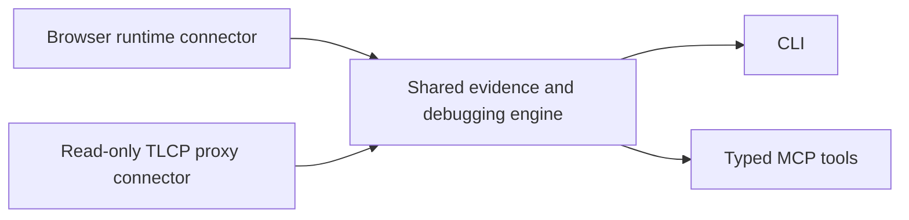

# Standalone Lightstreamer debugger feasibility

Date: 2026-10-02. Status: analysis and proposal, not an accepted architecture decision.

Change class: Non-UI research. This note changes no production behavior or accepted UI contract.

## Conclusion

A cross-platform CLI or local process is feasible. The important choice is its observation boundary. A browser runtime connector can potentially retain Workbench's application-level debugging and Local Injection semantics without installing an extension. A traffic proxy can cover more client technologies and diagnose protocol behavior, but observes a different kind of Evidence. An independent Lightstreamer client is useful for server testing, but creates its own Session.

These are feasibility inferences from the documented capabilities below. No implementation, live interception, or downstream application verification was performed for this analysis.

## Three possible products

The following comparison is an architectural inference, not a claim that any proposed backend already exists.

| Approach | What it observes | Best fit | Main setup requirement | Reproduction boundary |
|---|---|---|---|---|
| CLI with browser runtime instrumentation | The inspected page's official Web Client objects and deliveries | Extension-free Workbench for browser apps and agents | Launch or attach to a supported debugging browser; install hooks early | Potentially the selected page Subscription, after preserving current target checks |
| CLI with a TLCP-aware traffic proxy | Requests and notifications crossing the proxy | Browser/native client transport, Session, subscription, and protocol diagnostics | Route the selected app through the proxy; enable TLS visibility where needed | Protocol experiments need a separate design; application delivery is unproven |
| CLI built around an official client SDK | Its own subscriptions and SDK callbacks | Backend connectivity tests, command-line feed inspection, CI | Supply server, authentication, Adapter Set, items, fields, and preferences | Its own Session and subscriptions |

Removing the extension and removing browser runtime access are separate decisions. A CLI can operate a browser without being a browser extension.

## What the protocol makes possible

**Documented facts.** Public TLCP 2.5.0 covers HTTP/HTTPS and WebSocket/WSS, HTTP streaming and long polling, and mixed transports within a Session. Subscription requests include mode, group, schema, and adapter information. Notifications address subscription and item positions. `SUBCMD` supplies key and command field positions. Update decoding includes unchanged fields/runs, null versus empty strings, percent encoding, JSON Patch, and TLCP-diff. Snapshot classification depends on subscription preferences, mode, update position, and `EOS`; `CS` clears a snapshot. Session recovery uses notification progress and may resend earlier notifications that the client discards. [TLCP specification, Chapters 1–3 and Appendix D](https://lightstreamer.com/sdks/ls-generic-client/2.5.0/TLCP%20Specifications.pdf).

**Inference.** A useful proxy is therefore a stateful observer, not a logger that splits WebSocket frames on a delimiter. It needs protocol-version handling, continuity tracking, incremental framing, and honest unknown-state reporting. Starting after subscription establishment or losing decoder state must reduce its completeness claim.

**Documented COMMAND distinction.** COMMAND delta delivery is relative to the previous update for the same item, which can concern a different key. COMMAND row updates also use the previous ADD/UPDATE for the same key when filling omitted row values. Two-level push automatically creates MERGE subscriptions as keys appear and removes them as keys disappear. [General Concepts, §3.2.3, “COMMAND Mode” and “Two-level Push”](https://lightstreamer.com/ls-server/latest/docs/General%20Concepts.pdf).

**Inference.** Wire decompression and the COMMAND table projection need separate state. A decoder that treats every unchanged wire field as the previous same-key field can produce convincing but incorrect tables.

## Why traffic Evidence differs from application Evidence

**Documented facts.** The Web Client's `ItemUpdate` exposes complete available field values, same-key COMMAND changed-field semantics, and snapshot classification. With two-level behavior, it exposes the union of first- and second-level fields and generates UPDATE semantics for second-level changes. These are SDK interpretations, beyond the received bytes. [Web Client 9.0.0 `ItemUpdate`](https://sdk.lightstreamer.com/ls-web-client/9.0.0/api/ItemUpdate.html).

Item Groups and Field Schemas are symbolic identifiers expanded by the server's Metadata Provider; SDK consumers can use positional identities when lists are unavailable. Explicit Item Lists and Field Lists carry names. Subscription objects also contain registered listeners and configuration. [Web Client 9.0.0 `Subscription`](https://sdk.lightstreamer.com/ls-web-client/9.0.0/api/Subscription.html).

**Inference.** A proxy may show `field[3]` with a value while lacking a trustworthy field name. It should accept explicit mappings and preserve positional identities rather than guessing schema expansion. Network observation alone cannot establish which JavaScript listeners received an update, which callback threw, what was queued before a wire submission, or whether the application changed its UI. Two-level network subscriptions cannot generically be equated with one public application Subscription without additional runtime information.

The SDK additionally reports snapshot clearing and server lost-update conditions through distinct callbacks. Its recovery timeout can lead to creation of a new Session after unsuccessful recovery. [SubscriptionListener](https://sdk.lightstreamer.com/ls-web-client/9.0.0/api/SubscriptionListener.html), [ConnectionOptions.setSessionRecoveryTimeout](https://sdk.lightstreamer.com/ls-web-client/9.0.0/api/ConnectionOptions.html#setSessionRecoveryTimeout).

**Design implication.** Keep raw network observations, decoded protocol observations, and captured application Item Updates distinguishable. A complete local trace still cannot prove complete upstream server activity. Late capture, decoder uncertainty, retention, transport recovery, and application delivery should remain separate qualifications.

## TLS and cross-platform interception

**Documented facts.** Passive TLS decryption needs suitable secrets. Wireshark supports per-session key logs; server RSA private keys cannot decrypt TLS 1.3 or connections using (EC)DHE. Key logging requires cooperation from the client/server TLS implementation. [Wireshark TLS documentation](https://wiki.wireshark.org/TLS#tls-decryption).

An active HTTPS/WSS proxy terminates TLS and presents its own certificate. The inspected client must trust its CA. Certificate pinning can reject that certificate despite ordinary CA trust. [mitmproxy certificates](https://docs.mitmproxy.org/stable/concepts/certificates/).

**Inference.** A background packet sniffer cannot generically read arbitrary encrypted Lightstreamer traffic without preparation. A proxy can avoid modifying application source, but adds routing and trust setup and changes the network path being diagnosed. Explicit per-application proxy configuration is a reasonable first boundary when the application supports it.

mitmproxy provides binaries/tools on Windows, macOS, and Linux. Its regular mode uses explicit HTTP proxy configuration. Its local capture mode also supports all three systems, but Linux requires a privileged subprocess and supported kernel, has container restrictions, and does not support WSL for that capture mode. macOS local capture is egress-only. [Installation](https://docs.mitmproxy.org/stable/overview/installation/), [Proxy modes and local capture limitations](https://docs.mitmproxy.org/stable/concepts/modes/).

**Inference.** Cross-platform code is achievable; identical zero-setup interception behavior across operating systems is a much larger requirement. An initial product should state its supported routing mode rather than promise that launching one command observes every application.

## HTTP streaming is a first-class requirement

**Documented facts.** mitmproxy normally buffers an entire HTTP body before forwarding it. Streaming must be enabled before body processing; its API supports a callback for chunks and warns that packet boundaries are unreliable. A plain `.stream = True` flag forwards the body without buffering it for completed-body inspection. [mitmproxy HTTP streaming API](https://docs.mitmproxy.org/stable/api/mitmproxy/http.html).

It supports WebSocket messages and compression, but generic WebSocket client/server replay is not implemented. [mitmproxy protocol support](https://docs.mitmproxy.org/stable/concepts/protocols/#websocket).

**Inference.** A prototype needs a chunk callback that copies bytes to an incremental decoder while returning the original bytes for live forwarding. Merely switching on streaming or inspecting a completed response is insufficient. Otherwise the observer can create buffering failures that it then misdiagnoses. A general proxy's record/replay feature is not sufficient for a Lightstreamer Scenario engine.

## Extension-free browser runtime access

**Documented facts.** Playwright can add initialization scripts before document scripts execute, including newly attached/navigated child frames. CDP similarly provides `Page.addScriptToEvaluateOnNewDocument`. [Playwright BrowserContext.addInitScript](https://playwright.dev/docs/api/class-browsercontext#browser-context-add-init-script), [official CDP Page definitions](https://raw.githubusercontent.com/ChromeDevTools/devtools-protocol/master/pdl/domains/Page.pdl).

Playwright can attach through CDP to Chromium-based browsers; its documentation describes this as a lower-fidelity connection than its native protocol. Chrome 136 introduced a non-default user-data-directory requirement for remote debugging port/pipe launches targeting ordinary Chrome profiles. [Playwright connectOverCDP](https://playwright.dev/docs/api/class-browsertype#browser-type-connect-over-cdp), [Chrome remote debugging changes](https://developer.chrome.com/blog/remote-debugging-port).

CDP Network events expose WebSocket sent/received payloads. Its experimental `streamResourceContent` supplies buffered response data and enables future HTTP response bytes in `dataReceived`; ordinary chunk-length notifications alone are insufficient. [official CDP Network definitions](https://raw.githubusercontent.com/ChromeDevTools/devtools-protocol/master/pdl/domains/Network.pdl).

**Inference.** Browser-provided payloads avoid a separate TLS interception CA. CDP network observation still has the same semantic limits as wire observation. Installing the existing style of SDK hooks through CDP/Playwright offers a stronger parity path. Launch-before-load is the clearest initial contract: late attachment cannot retroactively observe private listeners or prior activity. Hooking private bundled constructors, workers, navigations, and frame lifecycles remains implementation work. Browser/OS support must be verified rather than inferred from an API name.

## Independent SDK client and Injection boundaries

**Documented fact.** The official Node.js client's `connect()` requests a Session and its SDK handles subscriptions and transport fallback. [Node.js Client 9.2.2 LightstreamerClient](https://sdk.lightstreamer.com/ls-nodejs-client/9.2.2/api/LightstreamerClient.html#connect).

**Inference.** A headless subscriber is the simplest standalone feed reader. It cannot prove what the original application received, and authentication/subscription permissions or filtering may produce a different view. It needs its own setup and must identify its Session separately.

The Web Client's `sendMessage` submits a message for interpretation by the Metadata Adapter of its current Session, with SDK-managed ordering, batching, retries, and outcome callbacks. [Web Client LightstreamerClient.sendMessage](https://sdk.lightstreamer.com/ls-web-client/9.0.0/api/LightstreamerClient.html#sendMessage).

**Repository contract.** Workbench Local Injection delivers to a selected runtime Subscription and its current listeners; Server Injection uses the inspected client's normal `sendMessage` path. Captured originals remain unchanged. See [ADR 0001](../adr/0001-keep-capture-observational.md), [ADR 0002](../adr/0002-scope-local-injection-to-one-subscription.md), and [ADR 0004](../adr/0004-send-server-injections-as-client-messages.md).

**Inference.** A pure proxy cannot promise this Injection parity. Forging or changing a downstream notification is a protocol experiment with compression, recovery, and attribution consequences. Sending directly on a Session can bypass the page SDK's submission bookkeeping. Sending from an independent SDK client belongs to its own Session. Runtime access is the direct route to preserving reviewed, selected-Subscription Local Injection; observed delivery still needs separate downstream application verification.

## Agent usefulness and packaging

**Proposal.** Expose one local engine through a CLI for people and typed stdio MCP tools for agents. Use explicit target/session handles, stable cursors, bounded query results, projections with coverage/continuity metadata, and prepared Scenario revisions with execution receipts. Avoid making agents parse a terminal screen or treating transport output as proof of a user-visible application effect.

Capabilities should be explicit per backend: inspect, protocol diagnosis, Local Injection, and reviewed Client Message submission. The read-only traffic backend should advertise unavailable runtime capabilities rather than emulate them through arbitrary network mutation. Keep raw credentials, TLS secrets, and unrestricted all-application capture outside default queries; limit retained data to the selected target's bounded session and deliberately generated artifacts.

**Packaging fact.** Node.js supports single executable distribution, but its current documentation lists platform and architecture caveats, and the feature is still under active development. [Node.js single executable applications](https://nodejs.org/api/single-executable-applications.html#platform-support).

**Inference.** An npm CLI is a sensible first distribution path for the TypeScript codebase. A signed per-OS binary is a later packaging choice, not evidence that protocol observation is solved. Go or Rust could host a proxy, but changing implementation language does not remove TLS setup or restore SDK semantics.

## Remaining questions

This study establishes documented building blocks, not measured product parity. A follow-up spike should resolve early-install coverage, supported Web Client versions, browser profiles/authentication, incremental HTTP capture, protocol-diff correctness, two-level COMMAND correlation, recovery duplication, bounded storage, and what the agent can truthfully claim after disconnection or a late start. The intended scope must choose between an extension-free browser Workbench and a broader network diagnostic tool before implementation commitments.

## What the current repository can contribute

The existing companion already distributes a Node 22.12+ executable through npm for Windows, macOS, and Linux. It exposes stdio MCP and automatically starts or connects to a loopback broker. It is a transport to Workbench, rather than a standalone collector: the router recognizes agent and panel peers and forwards commands to an exact `panelSessionId`. These facts come from the [companion package](../../agent/package.json), [CLI](../../src/agent/companion/cli.ts), [MCP server](../../src/agent/companion/mcp.ts), and [router](../../src/agent/companion/router.ts).

Useful reuse boundaries are already present:

| Existing part | Reuse opportunity | Work still needed |
|---|---|---|
| [Page instrumentation](../../src/injected/lightstreamer-instrumentation.ts) | Official-client hooks, target registry, listener delivery, WebSocket fallback | Replace the extension bridge; prove early installation, navigation, frames, and private-constructor coverage |
| [Event envelope](../../src/core/event-envelope.ts), normalization, filters, and [COMMAND reducer](../../src/core/command-state.ts) | One semantic vocabulary and query/projection implementation | Preserve listener versus wire provenance and avoid equating protocol subscription IDs with public runtime objects |
| [AgentRuntime](../../src/extension/panel/agent-runtime.ts) and [agent service](../../src/extension/panel/agent-service.ts) | Typed queries, committed read points, cursors, response budgets, and operation receipts | Generalize the host/session boundary and capability discovery without pretending a daemon is a mounted panel |
| [WorkbenchRuntime](../../src/extension/panel/workbench-runtime.ts) | Injectable history, scheduling, and Local/Server Injection executors | Separate panel visibility and document interaction rules from standalone execution ownership |
| [Event History](../../src/core/event-history-authoritative.ts) | Memory-backed journal and acceptance/retention contracts | Select and verify a standalone storage adapter; Node does not inherit browser IndexedDB |

The existing fallback decoder is embedded in the page instrumentation. It handles selected WebSocket subscription/update notifications and tracks per-item field state. Unsupported difference formats remain explicitly unresolved through `unsupportedDiffFields` and value-state markers. This is a useful starting point, not proof of complete HTTP, recovery, or protocol-difference support. Its normalization already marks wire observations separately. See the [implementation](../../src/injected/lightstreamer-instrumentation.ts) and [fallback tests](../../tests/instrumentation-lifecycle.test.ts).

## Recommended product shape

**Proposal.** Keep one shared semantic engine with source-specific capabilities, and expose it to humans through a CLI and agents through MCP. The extension can continue to use the same domain logic. Start with one backend and add another only after its observation and execution boundaries are proven.

The browser connector is the recommended first backend when the objective is extension-free debugging of the same web application, including selected-Subscription Local Injection. A managed browser launched before navigation provides the clearest initial workflow. Attaching to a browser already exposing a debugging endpoint can follow, with limited coverage reported for pre-existing activity. This first scope is cross-platform operating-system support with a Chromium browser, not universal browser attachment.

If the primary objective is observing compatible native clients as well as browsers, start instead with an explicitly configured, read-only proxy. Use an established proxy engine for routing/TLS during the spike. Keep forwarding independent of journal writes and agent queries, bound decoder work, and measure the added latency. Proxy failure can break the inspected connection, so payload preservation alone does not establish observational equivalence. Broad process capture and protocol simulation are later capabilities.

For agents, the value is asking for subscriptions, retained updates, COMMAND rows, snapshot status, and diagnostics through bounded structured queries. A raw terminal stream alone does not deliver the current MCP investigation experience. Report capability, source, target, continuity, and limitations with every relevant result. Preserve existing Local Injection target validation and operation identity. The current MCP surface does not expose Server Injection; adding it would be a separate reviewed capability, not an automatic consequence of adding a CLI.

## Decisions that a standalone implementation would reopen

This proposal goes beyond the accepted DevTools-only runtime constraint in [AGENTS.md](../../AGENTS.md). [ADR 0016](../adr/0016-panel-owned-agent-access.md), [CONTEXT.md](../../CONTEXT.md), and [ADR 0014](../adr/0014-continue-event-history-with-rolling-retention.md) assign Evidence and agent access to a mounted Panel Session. A daemon needs an explicitly designed investigation owner, lifetime, clear/close behavior, and access policy. The proposal should amend or extend those contracts before production integration; this research note does not amend them.

[ADR 0001](../adr/0001-keep-capture-observational.md) preserves the application's original activity path. An active proxy introduces an additional network hop and must state that boundary openly, even when it forwards payloads unchanged. The first proxy scope should diagnose traffic. Any future synthetic inbound delivery needs its own provenance and state/recovery contract; it cannot silently become the existing runtime Local Injection capability.

## Smallest useful follow-up spike

For the recommended browser path, launch the existing official-client fixture without loading the extension, install instrumentation before its application scripts, and bring captured activity into a bounded in-memory history. Prove an MCP query and one selected-Subscription Local Injection through that host. Compare with the existing fixture proofs, including two matching Subscriptions, listener changes, and page reload invalidation. Verify an explicitly limited result when only wire fallback is available. The [current official-client browser proof](../../tests/lightstreamer-local-injection.browser.spec.ts) provides comparison material, but its extension-based results do not validate this new backend.

For the proxy path, demonstrate incremental forwarding over both WebSocket and HTTP streaming, reconstruct interleaved COMMAND keys against SDK callback evidence, and verify snapshot and reconnect behavior before exposing a state claim. Include late start and unsupported decoding cases. TLS setup must be reproduced on the supported operating systems. Do not begin by rewriting updates or building a custom TLS interception engine.

These are bounded experiments, not a release plan or effort estimate. Their result should determine whether the next product increment is a browser Workbench CLI or a broader Lightstreamer protocol debugger.
